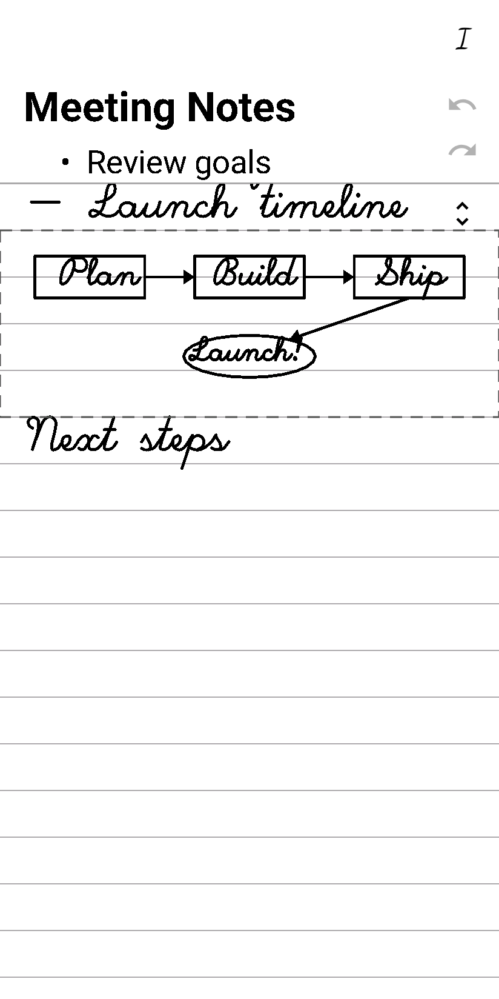
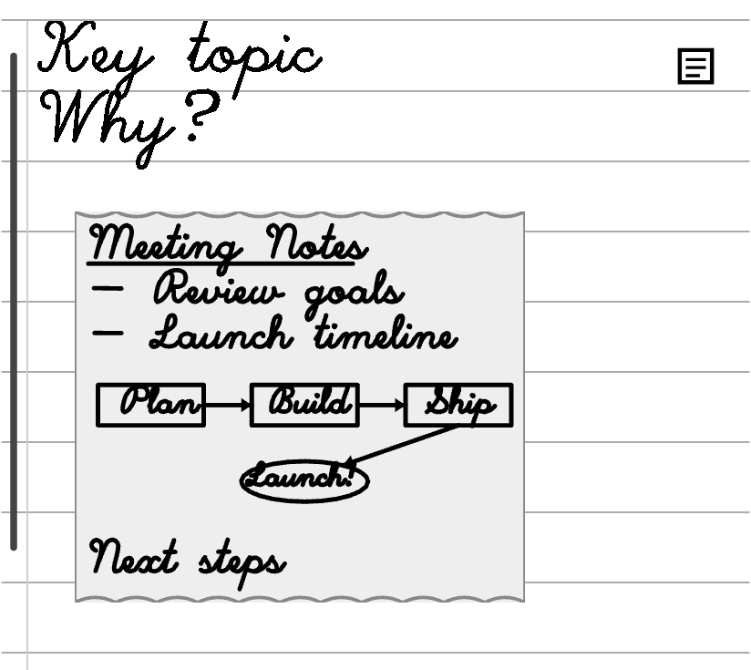

# Mokke

> A note-taking system that respects the physicality of handwriting while unlocking the composability of digital.

Every note-taking app forces a choice: capture naturally with a stylus, or capture in a format that's useful later. Handwriting apps produce dead-end image files. Structured apps demand you type and organize in real time, breaking the flow of thought.

Mokke bridges the gap. Write and draw freely on an e-ink tablet. Mokke recognizes your handwriting, classifies your diagrams, and produces clean, structured text — without modes, without menus, without interrupting your thinking.

<div align="center">
  <table>
    <tr>
      <td><br /><em>Notes view</em></td>
      <td><br /><em>Cue view</em></td>
    </tr>
  </table>
</div>

## Features

### Two instruments, zero modes

Stylus always writes. Finger always navigates. No mode switching, no gesture conflicts. The interaction model follows a simple invariant: the pen creates, the hand moves.

### Live handwriting recognition

Write naturally and see formatted text appear as you scroll. Mokke uses Boox MyScript handwriting recognition with ML Kit fallback, re-recognizing text as context grows. Headings, bulleted lists, and paragraphs are detected automatically.

### Cornell Notes

Landscape mode provides a two-column layout: main notes on the left, cues and annotations on the right. Both columns scroll in lockstep so cues always align to their referenced content.

In portrait mode, fold between Notes and Cues views with a tap. A cue indicator strip shows where annotations exist; a context rail minimap provides orientation in Cues view.

### Diagrams

- **Auto-detect** — draw a shape and Mokke creates a diagram area around it. No gesture or mode switch required.
- **Shape snap** — hold at the end of a stroke to snap to rectangles, ellipses, triangles, diamonds, arrows, elbows, arcs, and self-loops
- **Magnetic connectors** — arrow endpoints snap to nearby shapes. Elbow and arc connectors support arrowheads at either or both ends.
- **Diagram text** — freehand labels inside diagram areas are recognized and displayed
- **Mermaid export** — diagrams export as Mermaid syntax in markdown

### Editing

- **Scratch-out to erase** — scribble over content to remove it. Works across both columns and inside diagram areas.
- **Strikethrough to delete** — draw a horizontal line through text to delete the line
- **Insert/remove space** — tap the gutter button, then drag to push content apart or close gaps. Affects both columns while preserving cue anchoring.
- **Undo/redo** — gutter buttons with smart coalescing (rapid strokes group into one undo step)

### Document management

- **Multi-document** — create, open, and rename documents from the menu
- **Handwritten rename** — write a new name with the stylus in the rename dialog, with live recognition and scratch-out support
- **Auto-naming** — documents are automatically named from the first heading
- **Markdown export** — share notes as markdown with diagrams as Mermaid blocks and cues as blockquotes
- **Sync folder** — export to a folder via Android Storage Access Framework

### E-ink optimized

Designed for Onyx Boox devices with low-latency Pen SDK integration. Supports dual-canvas hover-based input routing in landscape. Tested on Tab X C, Note Air 5C, Go 7, and Palma 2 Pro with responsive layout scaling across screen sizes.

### Onboarding

Interactive 4-step tutorial — write, draw, erase, scroll — with Hershey single-stroke fonts for realistic demo content and progressive reveal animations.

## File format

Documents are stored as `.inkup` binary protobuf files with compact column-oriented stroke encoding. The format supports backward-compatible schema evolution with golden file tests for every version. A standalone `inkup-viewer` tool can open `.inkup` files on macOS.

## Building

```bash
./gradlew assembleDebug
```

### Install to a connected device

```bash
./gradlew installDebug
```

### Run tests

```bash
# Unit tests (no device required)
./gradlew testDebugUnitTest

# Connected device tests (requires Boox tablet)
./gradlew connectedConnectedTestAndroidTest
```

## Vendored dependencies

[`inksdk`](https://github.com/imedwei/inksdk) is vendored under `third_party/inksdk` as a `git subtree --squash` import. The currently-pinned upstream commit is recorded in [`third_party/inksdk/UPSTREAM.md`](third_party/inksdk/UPSTREAM.md).

### Update to latest upstream

```bash
./scripts/update-inksdk.sh           # pull from main
./scripts/update-inksdk.sh some-tag  # pull a specific branch or tag
```

The script auto-detects whether to run `git subtree add` (first import) or `git subtree pull`, refuses to run on a dirty working tree, and refreshes `UPSTREAM.md` with the resolved SHA in a single follow-up commit.

### See what's new upstream before pulling

Add inksdk as a git remote (one-time, per clone):

```bash
git remote add inksdk https://github.com/imedwei/inksdk
git fetch inksdk
```

Then to see commits on upstream's `main` that aren't in our pin yet:

```bash
git fetch inksdk
git log --oneline $(awk '/^\| Commit/ {gsub(/`/,"",$4); print $4}' third_party/inksdk/UPSTREAM.md)..inksdk/main
```

Or, to see the diff that an update would bring into the working tree:

```bash
git diff $(awk '/^\| Commit/ {gsub(/`/,"",$4); print $4}' third_party/inksdk/UPSTREAM.md) inksdk/main -- .
```

## Architecture

See [docs/VISION.md](docs/VISION.md) for the product vision, interaction philosophy, and design principles.

## License

MIT
