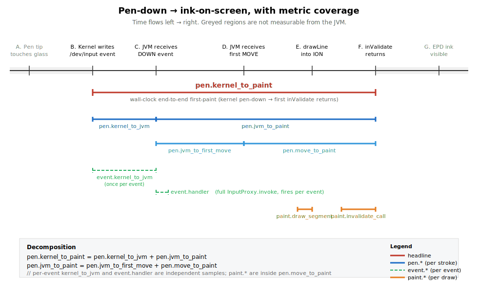

# inksdk

Slim e-ink low-latency stylus library for Android. Wraps the per-vendor pen
pipelines that bypass Android's standard view system on Bigme and Onyx Boox
e-readers, exposing a single `InkController` interface plus a tiny demo app
to measure end-to-end pen latency without the noise of a host application.

## Why

Production stylus apps on e-ink hardware build up a lot of host-side
machinery (palm rejection, gesture detection, scratch-out, snap, autosave,
caching). Each layer adds latency between pen-down and visible ink. This
library is the *minimum* needed to engage the vendor's hardware ink pipeline,
plus first-class perf counters so we can measure exactly where the latency
goes. If the demo's down-to-paint p50 is ≤ 5 ms on a Bigme HiBreak Plus,
we know the platform is fast and any host slowness is on us.

## Modules

- `:inkcontroller` — the library. Defines `InkController` and ships
  `BigmeInkController`, `OnyxInkController`, `NoopInkController`, plus the
  daemon-side perf counters.
- `:demo` — single-Activity sample. A `SurfaceView` that attaches to whatever
  controller the factory picks, plus Clear and "Dump perf" buttons.

## Build / install

```bash
./gradlew :demo:assembleDebug      # build APK
./gradlew :demo:installDebug       # install to a connected device
```

## Tests

```bash
./gradlew :inkcontroller:testDebugUnitTest   # Robolectric (Noop, Factory, PerfCounters)
./gradlew :inkcontroller:connectedDebugAndroidTest  # device-only (auto-skips by vendor)
./gradlew :demo:connectedDebugAndroidTest    # smoke test
```

The connected-device tests use `Assume.assumeTrue` to gate vendor-specific
checks, so a single suite runs on Bigme, Onyx, or generic Android — only the
applicable subset executes.

## Perf counters

Every metric is recorded on the daemon binder thread (Bigme) with no
allocations on the hot path. Three tiers by sample rate:

- **`pen.*`** — once per stroke. Headline is `pen.kernel_to_paint`
  (wall-clock from kernel pen-down to first inValidate returning).
- **`event.*`** — once per binder input event. Dispatch + handler timing.
- **`paint.*`** — once per draw segment. drawLine + inValidate calls.

See [`docs/metrics.md`](docs/metrics.md) for full definitions and the
diagram below showing which boundaries each metric spans.



```kotlin
val s = PerfCounters.get(PerfMetric.PEN_KERNEL_TO_PAINT)
Log.i(TAG, "first paint p50=${s.p50Ms}ms p95=${s.p95Ms}ms")
```

The "Dump perf" button in the demo logs and on-screen-prints the full
counter table.

### Custom metric prefix

Counter labels are prefixed with `"ink."` by default. Hosts integrating
multiple perf systems can override at startup:

```kotlin
PerfCounters.prefix = "myapp.ink."
// PerfMetric.PEN_KERNEL_TO_PAINT.label is now "myapp.ink.pen.kernel_to_paint"
```

Set to `""` to drop the prefix entirely.

### Per-controller coverage

`paint.*` and the paint-side `pen.*` metrics rely on a JVM-side "first
paint issued" moment. Bigme exposes one (we call `inValidate` ourselves);
Onyx hides paint inside `TouchHelper`'s native code, so those metrics will
report `count=0` on Onyx. The `pen.kernel_to_jvm`,
`pen.jvm_to_first_move`, `event.kernel_to_jvm`, and `event.handler`
metrics compose on both controllers (Onyx wiring is planned). See
[`docs/metrics.md`](docs/metrics.md#per-controller-coverage) for the
matrix.

## Adding to another project

```kotlin
// settings.gradle.kts
include(":inksdk")        // or use as a Maven publication once we add it
project(":inksdk").projectDir = file("../inksdk/inkcontroller")
```

```kotlin
// app/build.gradle.kts
dependencies {
    implementation(project(":inksdk"))
}
```

```kotlin
val ink = InkControllerFactory.create()
ink.attach(surfaceView, Rect(0, 0, surfaceView.width, surfaceView.height), callback)
ink.setStrokeStyle(widthPx = 6f, color = Color.BLACK)
```

The Onyx SDK is bundled as an `implementation` dep, so consumers do not need
to add the Boox Maven repo themselves. Onyx attach fails cleanly on non-Onyx
devices.

## Vendor-runtime requirements

- **Bigme**: requires `com.xrz.HandwrittenClient` in the boot classpath (xrz
  firmware, e.g. HiBreak Plus). Reflective; no permission needed.
- **Onyx**: requires the Boox vendor SDK runtime. The class load succeeds on
  any device but `attach` throws on non-Onyx and we return false.
