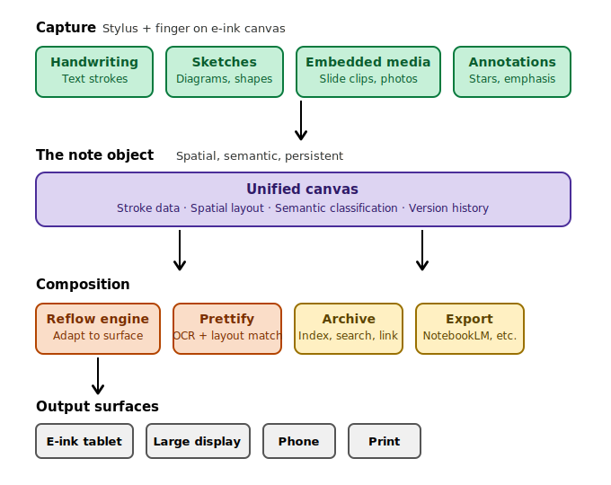

# Mokke — Product Vision

> A note-taking system that respects the physicality of handwriting while unlocking the composability of digital.

*Draft · March 2026*

---

## Product thesis

Every note-taking app forces a choice: capture naturally with a stylus, or capture in a format that's useful later. Handwriting apps produce dead-end image files. Structured apps demand you type and organize in real time, breaking the flow of thought. The gap between *capturing an idea* and *composing with it later* is where most note-taking tools fail.

Mokke bridges this gap. It treats handwritten strokes, diagrams, and embedded media as first-class objects—not raster images—that preserve spatial layout, support semantic classification, and reflow intelligently across surfaces. The result is a note that lives beyond the moment of capture: it can be prettified, projected, annotated, archived, cross-referenced, and exported into downstream tools like NotebookLM.

> **Core bet:** The gap between "fast enough to capture a thought" and "structured enough to use later" is a real, unsolved problem. E-ink is the right surface for bridging it—it removes the screen's distraction tax while enabling digital persistence.

### Conceptual architecture

---

## User journeys

These journeys define the critical paths that every design and engineering decision must serve. Each journey has a **capture phase** (real-time, low-friction), a **composition phase** (post-capture enrichment), and an **output phase** (the note becomes useful beyond itself).

### Journey 1: The learner

**Persona:** A conference attendee, grad student, or professional in a lecture or presentation. They think with their hands. They need to capture fast and refine later.

#### Capture

The user is handwriting key phrases from a speaker. A slide flashes by with a Venn diagram that resonates. Without switching modes or opening a menu, they sketch the diagram directly into the same note, spatially adjacent to their text. The note captures both the words and the visual artifact in their original spatial relationship—exactly as they would appear on a physical notepad.

#### Composition

- **Prettify:** At home, the user triggers a prettification pass. Handwriting is replaced with legible typeset text, preserving the original spatial layout. The sketch is kept as-is (or optionally cleaned up). The result looks like a well-formatted page, not a scan of messy notes.
- **Reflow:** The user projects the note onto a larger screen. The reflow engine adapts the layout: text and drawings are resized and repositioned to make judicious use of the extra real estate, while preserving the conceptual groupings from the original note.
- **Annotate:** The user adds post-hoc annotations: correcting a term now that they understand the full presentation, starring key points, adding marginal commentary. These annotations are versioned—the original capture is never destroyed.

#### Output

The entire note—strokes, prettified text, diagrams, annotations—is exported to NotebookLM alongside the original slides or video. The downstream tool generates a structured summary, audio recap, or study guide. The note has traveled from a fleeting moment of capture to a durable learning artifact.

### Journey 2: The spontaneous idea

**Persona:** A product designer, founder, or engineer who thinks visually and iterates on ideas by drawing them. They need seamless text+diagram integration and the ability to return to an idea later.

#### Capture

An idea strikes. The user opens Mokke and begins sketching a user journey: a cartoon-style storyboard of UI screens connected by text descriptions. The tool doesn't force a choice between "drawing mode" and "text mode." Strokes are strokes. The system classifies them semantically after the fact.

#### Composition

- **Archive and retrieve:** The note is filed in the user's archive. It's indexable by semantic content (not just filename), cross-referenceable with other notes, and retrievable months later when the idea becomes relevant again.
- **Surface transition:** The user opens the note on a larger writing surface. The storyboard reflows cleanly into the larger canvas—frames expand, text becomes more readable, the spatial narrative is preserved.
- **Iterate:** The user rearranges storyboard frames, cuts whole frames, inserts new elements. The note is a living document, not a frozen snapshot. Frame-level manipulation—drag, reorder, delete, insert—is the core editing primitive for this journey.

---

## Interaction philosophy

The interaction model is the product's deepest differentiator. Hardware can be copied. Features can be replicated. But an interaction model that feels *inevitable*—where the user never wonders "how do I do this?"—is extremely hard to replicate because it requires saying no to hundreds of clever ideas that would individually be impressive but collectively create cognitive overhead.

### The two instruments

Every interaction on the device maps to exactly one of two physical instruments. There is no third mode.

|                | The Hand (finger) | The Stylus |
|----------------|-------------------|------------|
| **Primary role** | Navigate. Push, pull, scroll the page. Select and manipulate objects at a coarse level. | Create. Draw strokes for letters, lines, shapes. The stylus always writes—no mode switch needed. |
| **Mental model** | Like holding a piece of paper and moving it around on a desk. | Like holding a pen. Whatever you do with the pen goes on the paper. |
| **Invariant** | The hand never creates content. It never accidentally deletes content. | The stylus always creates content. Its strokes are never silently consumed by gesture recognition. |

### Design principles

These principles are ordered by priority. When two principles conflict, the higher-numbered one yields.

1. **No accidental data loss.** No gesture, touch, or stylus action should be capable of silently destroying user work. If a destructive action occurs (collapse, delete, clear), it must be immediately visible and trivially reversible. The vertical-line-collapse pattern in the current Mokke is a cautionary example: it removes content from view and an inattentive user may not notice the loss.

2. **Discoverable essentials, learnable shortcuts.** Every essential function must be discoverable without a tutorial. This means visible affordances (icons, buttons, labeled controls) for actions the user needs to find within their first session. Advanced gestures may exist as *accelerators* for already-discovered functions—never as the *only* path to a needed action. The test: if a new user can't find the feature in 30 seconds, it needs a visible affordance.

3. **Minimize cognitive state.** The user should never need to track which "mode" the app is in. Every mode toggle—finger vs. stylus, draw vs. select, navigate vs. edit—is a piece of invisible state the user must maintain in consciousness. Each one adds cognitive load that competes with the actual thinking they're trying to capture. Eliminate modes wherever possible. Where modes are unavoidable, make the current state persistently visible.

4. **Convenience must not cannibalize creation.** Gesture shortcuts must never intercept strokes that a user might genuinely intend to draw. An L-shaped stroke being captured as undo/redo is a direct violation: the system is eating the user's drawing to provide a shortcut. The rule is simple—if a gesture shape overlaps with any plausible drawing stroke, it cannot be used as a gesture unless the user has explicitly opted in.

### Anti-pattern catalog

Every new interaction proposal should be checked against this catalog before implementation.

| Anti-pattern | Example | Violates |
|---|---|:---:|
| Undiscoverable essential | Squiggle-then-downstroke to insert a diagram. No visual cue exists. User can't draw diagrams without reading docs. | #1, #2 |
| Gesture-only undo | Two-finger tap or special stroke to undo with no visible undo button. User must learn app-specific gesture vocabulary. | #2 |
| Mode toggle | A switch between "finger mode" and "stylus mode." User must remember current state, and wrong-mode interactions produce unexpected results. | #3 |
| Stroke consumption | L-shaped stroke intercepted as undo/redo. User drawing an L, an angle, or a box corner has their work eaten. | #4 |
| Silent destruction | Vertical line-up collapsing space between lines and vanishing content. Reversible, but damage is invisible to an unaware user. | #1 |

---

## The note object model

The central technical and conceptual insight of Mokke is that a note is not an image, not a document, and not a canvas—it is a **structured spatial object** with four properties that existing tools only partially provide.

### Spatial fidelity

Stroke data preserves the spatial relationships of the original capture. Text written next to a diagram stays next to it. The note remembers *where* things are relative to each other, not just *what* they contain.

### Semantic classification

Strokes are classified after the fact—not during capture—into semantic categories: text, diagram, annotation, embedded media. This classification enables downstream operations (prettify text but preserve diagrams, index text for search, treat annotations as a separate layer).

### Surface independence

The note is not bound to the surface it was captured on. A reflow engine can adapt the layout to any target surface—a larger tablet, a projected screen, a phone, a printed page—while preserving the conceptual groupings and spatial relationships of the original.

### Version persistence

Every state of the note is preserved. The original capture, the prettified version, each round of annotations—these are layers in a version stack, not destructive overwrites. The user can always return to any previous state.

---

## Product layers

From a product architecture perspective, Mokke has four distinct layers, each of which represents a separable engineering investment and a distinct source of user value.

### Layer 1: Capture

The e-ink canvas with stylus and finger input. This must be *zero-friction*: the user should feel no difference between reaching for a pen and paper vs. reaching for Mokke. Latency, palm rejection, and stroke rendering quality are table stakes. The differentiator is the interaction model—two instruments (hand and stylus) with clear, non-overlapping roles and no mode switching.

### Layer 2: The note object

The structured spatial data model described above. This is the core differentiator. Most note-taking tools stop at "strokes on a canvas"—Mokke promotes strokes to classified, spatially-aware, versionable objects. This layer enables everything above it.

### Layer 3: Composition

The post-capture enrichment tools: prettify (OCR + layout-preserving typesetting), reflow (surface-adaptive layout engine), annotate (versioned layer additions), and frame-level manipulation (for storyboard-style notes). Each of these is a meaningful feature in its own right, but they compound dramatically when they all operate on the same structured note object.

### Layer 4: Output and archive

The note's lifecycle beyond Mokke. This includes: indexing and full-text search across the note archive, cross-referencing between notes, and export to downstream tools (NotebookLM, slide generators, document editors). The archive turns Mokke from a capture tool into a personal knowledge system. The export pipeline turns it into a node in the user's broader workflow.

---

## What this is not

Clarity about what Mokke is *not* is as important as what it is. Scope discipline is what separates a product with a clear identity from a feature soup.

- **Not a drawing app.** Mokke is not competing with Procreate or Concepts. It does not need layers, blend modes, pressure curves, or color wheels. It needs strokes that capture thinking accurately.
- **Not a document editor.** Mokke is not competing with Notion or Google Docs. It does not need rich text formatting, database views, or collaborative editing. It needs notes that become useful after capture.
- **Not a whiteboarding tool.** Mokke is not competing with Miro or FigJam. It is not optimized for real-time multi-user collaboration on an infinite canvas. It is optimized for one person capturing and refining their thinking.
- **Not a general-purpose e-ink OS.** Mokke does one thing—note-taking—and does it in a way that no general-purpose e-ink tablet does today. Breadth is the enemy of the interaction model.

---

## Open questions

These are the decisions that will shape the product's trajectory and should be resolved through prototyping, not committee.

1. **Where does semantic classification happen?** On-device in real time (lower latency, works offline, but limited model capacity) vs. cloud-based post-capture (better accuracy, but introduces sync lag and connectivity dependency). Hybrid approaches exist but add complexity.

2. **What is the minimum viable reflow?** Full responsive layout is an enormous engineering investment. The minimum might be: scale uniformly to fill the target surface, with manual adjustment of individual elements. The question is whether users will tolerate the manual step.

3. **How does the archive scale?** Hundreds of notes with handwritten content require either very good OCR-based indexing, embedding-based semantic search, or both. The indexing strategy determines the archive's usefulness at scale.

4. **What is the export contract?** NotebookLM is a specific integration. The broader question is: what format does Mokke export? A proprietary format with rich metadata? Markdown with embedded images? PDF? The answer determines how freely notes travel through the user's broader workflow.

5. **Hardware-coupled or hardware-agnostic?** Is Mokke a software product that runs on existing e-ink tablets (Boox, reMarkable), or is it tightly coupled to specific hardware for optimal interaction? The answer has massive implications for who can use it, how fast the team can iterate, and how deep the experience can go.

6. **What is the frame model for storyboards?** The "spontaneous idea" journey implies discrete, reorderable frames. How are frame boundaries detected—explicit user action, spatial heuristics, or AI classification? Each has different failure modes.
