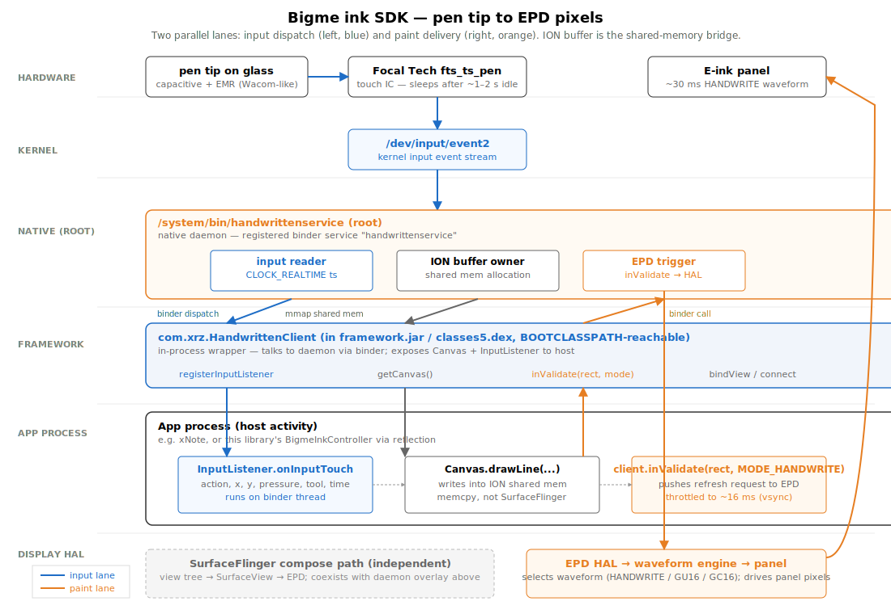

# How Bigme's ink SDK works — architecture & data flow

*A focused architecture explainer for the undocumented `com.xrz.HandwrittenClient` ink pipeline shipped on Bigme e-readers (HiBreak Plus probed). Companion to [`bigme-sdk-reverse-engineered.md`](bigme-sdk-reverse-engineered.md), which is the story of how this was discovered. This post is the reference for what's there and how the pieces fit together.*

---

[Source: `bigme-architecture.svg`](bigme-architecture.svg).

The diagram shows two parallel lanes from pen tip to visible ink:

- **Input lane (blue)** — kernel input event → daemon → binder dispatch → app's `InputListener` callback.
- **Paint lane (orange)** — app draws into a Canvas backed by ION shared memory → calls `inValidate(rect, mode)` → daemon pushes the dirty rect to the EPD HAL → waveform engine flips panel pixels.

Both lanes pass through one root daemon (`/system/bin/handwrittenservice`) and one shared-memory ION buffer. That single coordination point is what makes the pipeline fast and what makes coexistence with normal Android UI tricky.

---

## The components, top to bottom

### 1. Hardware: pen + touch IC + e-ink panel

- **Pen tip**: capacitive plus EMR (Wacom-style, no battery). Generates pressure and tilt signals.
- **Touch IC** on the HiBreak Plus is a Focal Tech `fts_ts_pen` chipset — a separate microcontroller that samples the pen, debounces, and writes input events to `/dev/input/event2`. **It sleeps after ~1–2 s of idle** (more on this below).
- **E-ink panel**: a typical Carta-class display. The panel controller integrates a *waveform table* selected by the EPD HAL. The fastest waveform Bigme exposes for ink is `MODE_HANDWRITE` (1029) at ~30 ms per refresh.

### 2. Kernel: `/dev/input/event2`

Standard Linux input subsystem character device. The pen IC is its sole producer. Two consumers compete:

- **Android `InputDispatcher`** (the standard path), which produces `MotionEvent`s. *This still happens* — the daemon doesn't intercept exclusively. Your app's `View.onTouchEvent` continues to fire normally.
- **The `handwrittenservice` daemon**, which `open()`s and `read()`s the device directly to get events with sub-frame latency.

Both paths see the same kernel input events. They produce different downstream artifacts (a `MotionEvent` vs a daemon callback) on different threads, with different latency profiles.

### 3. Native daemon: `/system/bin/handwrittenservice`

Runs as root, registered as the `handwrittenservice` binder service. Three concurrent jobs (sub-blocks in the diagram):

1. **Input reader.** A polling loop on `/dev/input/event2`. On each event the daemon stamps it with `CLOCK_REALTIME` and queues it for binder dispatch to whatever app process is bound.
2. **ION buffer owner.** When an app calls `connect(width, height)`, the daemon allocates an ION buffer of those dimensions in shared memory. ION is the legacy Android shared-memory allocator — see the [LWN intro](https://lwn.net/Articles/480055/). The same physical pages are mapped into the daemon's address space and the app's address space.
3. **EPD trigger.** When the app calls `inValidate(rect, mode)`, the daemon hands the request to the EPD HAL with the chosen waveform.

The daemon is what makes the whole thing fast. It bypasses both `InputDispatcher` (for input dispatch) and `SurfaceFlinger` (for paint commit). The ION buffer is the bridge that lets the app draw locally with ordinary `Canvas` calls while the daemon owns the actual pixels.

### 4. Framework wrapper: `com.xrz.HandwrittenClient`

Lives in `framework.jar`'s `classes5.dex`, BOOTCLASSPATH-reachable from any app. Not in any vendor jar — every Android process can `Class.forName("com.xrz.HandwrittenClient")` without privileges or shared-library symlinking.

The class is in-process, not a binder service in itself. It talks to the `handwrittenservice` daemon over binder. Its public surface is small (full reference in [`bigme-sdk-reverse-engineered.md`](bigme-sdk-reverse-engineered.md#the-full-api-surface)); for the architecture-level view, four methods matter:

| Method | What it does |
|---|---|
| `bindView(View)` | Tell the daemon which SurfaceView's ION buffer to allocate against |
| `connect(w, h)` | Allocate the ION buffer at view dimensions |
| `registerInputListener(InputListener)` | Receive binder callbacks from the daemon |
| `getCanvas() : Canvas` | Return a Canvas whose underlying bitmap is the ION buffer |
| `inValidate(rect, mode)` | Tell the daemon to push a dirty rect to the EPD HAL |

`getCanvas()` is the linchpin. The returned `Canvas` is hardware-backed; `drawLine` / `drawRect` / etc. write directly into the ION shared memory. There's no "commit" needed beyond the `inValidate` that follows — the daemon already sees the new pixels because it's the same memory.

### 5. App process

The app does three things, all in callbacks:

1. **Receives input events** through the registered `InputListener.onInputTouch(action, x, y, pressure, tool, time)`. This fires on a binder thread, **not** the main thread. The `time` argument is the daemon's `CLOCK_REALTIME` capture from step 3, used by the library for `event.kernel_to_jvm` / `pen.kernel_to_jvm` metrics.
2. **Paints** via the ION-backed Canvas. Typical pattern: track `lastX/lastY`, `drawLine(lastX, lastY, x, y, paint)`, accumulate a dirty rect.
3. **Triggers EPD refresh** via `inValidate(dirtyRect, MODE_HANDWRITE)`. Throttled to roughly one call per 16 ms (one vsync) to give the EPD waveform engine room to drain — calling more often produces "train track" partial-update artifacts on long strokes.

The callback path runs entirely on the binder thread until `inValidate` returns. No SurfaceFlinger is involved in the visible-ink path. The library's `BigmeInkController` then `mainHandler.post`s the same event up to the host's `StrokeCallback` for whatever app-level logic needs it (recognition, persistence, undo stack).

### 6. Display HAL

The EPD HAL takes `inValidate(rect, mode)` and translates it into waveform commands. The `mode` argument is an integer enum that picks which waveform table entry to use:

| Mode | Constant | Use |
|---|---|---|
| 1029 | `MODE_HANDWRITE` | Fast partial update for ink. ~30 ms per refresh. |
| 132 | `MODE_GU16` | 16-grey-level update without flash. Slower; clean. |
| 4 | `MODE_GC16` | Full global refresh with flash. Slowest. |

The waveform engine then drives the panel controller, which walks the waveform table for each affected pixel.

---

## The data flow, end to end

Trace one stroke from pen-down to visible ink:

1. **`t=0`** — pen touches glass.
2. **`t≈0–5 ms`** — Touch IC samples, writes an input event to `/dev/input/event2`.
3. **`t≈5–10 ms`** — Daemon's input-reader thread reads the event, stamps it `CLOCK_REALTIME`, and dispatches a binder callback to all bound apps.
4. **`t≈10–15 ms`** — Binder hop wakes the app's binder thread. `InputListener.onInputTouch(ACTION_DOWN, ...)` fires.
5. *(Pen moves; second event arrives shortly after.)*
6. **`t≈25–30 ms`** — Second event (`ACTION_MOVE`) fires the same callback. The app:
   - calls `client.getCanvas()` (cached on first call), draws a line segment from the previous point to this one,
   - accumulates a dirty rect,
   - calls `client.inValidate(dirtyRect, MODE_HANDWRITE)`.
7. **`t≈30–40 ms`** — `inValidate` round-trips to the daemon, which forwards to the EPD HAL.
8. **`t≈40–70 ms`** — EPD HAL programs the waveform engine; panel pixels begin flipping.
9. **`t≈70–80 ms`** — Visible ink on screen.

Steady state, with the touch IC awake, end-to-end is in the 30–60 ms range. The library's `pen.kernel_to_paint` metric measures steps 3–7 (kernel timestamp to `inValidate` returning); steps 8–9 are unobservable from software.

---

## What's distinctive

Three architectural properties set Bigme's design apart from the typical e-ink vendor SDK pattern:

**1. Two compositors share the panel.** The daemon paints stroke pixels via the EPD HAL. SurfaceFlinger paints the rest of the view tree (toolbar, text, buttons) via its normal compose path. Both reach the same panel via different paths. Most of the time this is fine — the daemon's stroke region is small and SurfaceFlinger's compose region is large, and they don't overlap visually. But they *do* share one resource at the bottom of the stack (the EPD HAL command queue), which is where the "UI redraws during writing" pathology comes from. See [`metrics.md` → "UI-compose stall"](metrics.md#ui-compose-stall-during-writing) for the measurements.

**2. The app does paint.** Onyx's TouchHelper hides paint inside the vendor SDK's native code; you don't get a `Canvas`. Bigme's design hands you a real `Canvas` and lets you draw whatever you want with it. This is more powerful (custom stroke styles, custom dynamics) but also more responsibility (you set the throttle interval, you accumulate the dirty rect, you choose the waveform mode).

**3. Input still flows the normal way.** Your app's `View.onTouchEvent` continues to receive `MotionEvent`s in parallel with the daemon's `InputListener` callbacks. This is unusual — most vendor input frameworks "swallow" touch events when active. On Bigme, the daemon callback gives you faster, lower-jitter input for the visible-ink hot path; the regular `MotionEvent` path stays available for app-level logic that doesn't need that latency. The library's `BigmeInkController.consumesMotionEvents` is `true` (we treat the daemon as authoritative once attached), but you could in principle use both.

---

## What this design pays for

Three concrete failure modes that stem from the architecture itself, all measurable:

### Touch-IC sleep wake — 80–170 ms first-stroke spike

The Focal Tech `fts_ts_pen` drops into a low-sample-rate sleep mode after ~1–2 s of idle. Physical capacitive proximity (pen hovering 1–2 cm above the glass) wakes it; software calls do not.

The xrz daemon does not dispatch hover or `ACTION_NEAR` events to registered InputListeners under any configuration we tried — neither cooked nor `setUseRawInputEvent(true)`. So the historical pre-warm pattern from xNote (issue a tiny `inValidate` to "wake" the panel) doesn't actually wake the touch IC; it reaches the EPD waveform engine, which is the wrong subsystem.

The result: a user writing continuously feels Bigme as fast (3–10 ms per stroke); a user that pauses to think pays an 80–170 ms wake-up cost on the first stroke after each pause. The library logs these as `SLOW_STROKE` events and recommends tracking `pen.kernel_to_paint` `p99` rather than p50/p95 — the per-pause wake hides in the long tail.

This is below the Android stack and we cannot fix it from the library (sysfs at `/sys/bus/i2c/drivers/fts_ts/` is permission-denied without root; relevant `vendor.*` system properties are SELinux-protected from `setprop`).

### UI-compose binder stall — linear-in-cadence dispatch latency

Concurrent UI updates during writing inflate `event.kernel_to_jvm` linearly with redraw cadence:

| Cadence | `event.kernel_to_jvm` p95 |
|---|---|
| No update | 1 ms |
| 1 Hz (per-second countdown) | 11 ms |
| 30 Hz (frame-rate counter) | **1062 ms** |

Mechanism: each `View.invalidate` triggers a SurfaceFlinger compose request that ends up at the EPD HAL command queue — the same queue the daemon writes to via `inValidate`. Two producers, one queue. At 30 Hz the queue saturates and every input event lands behind hundreds of milliseconds of contention.

Host rule: don't update non-canvas UI during writing. Batch and flush at `onStrokeEnd`. See [`metrics.md` → "UI-compose stall"](metrics.md#ui-compose-stall-during-writing).

### ION buffer never auto-clears — ghost accumulation

The daemon allocates the ION buffer once at `connect()` and reuses it forever. When the host paints over a region, the old ink is overwritten — but when the host *erases* a region (drawColor white over a sub-rect), the EPD doesn't actually refresh that region unless the host explicitly calls `inValidate(rect, MODE_GU16)` to push a clean update.

If you don't, the next stroke that crosses the "erased" region picks up ghost trails from the old ink that's still in the ION buffer. The library's `clearRegion(rect)` helper paints white into the daemon's Canvas without invalidating, which is correct *only* when the host's SurfaceView already shows the canonical post-erase pixels via SurfaceFlinger compose. Otherwise you need a `syncOverlay(bitmap, region, force=true)` to push a clean GU16 refresh.

This is documented in detail in [`InkController.kt`](../inkcontroller/src/main/java/com/inksdk/ink/InkController.kt)'s `clearRegion` and `syncOverlay` Kdoc; the practical takeaway is that the daemon owns long-lived state that needs to be reasoned about, not garbage-collected.

---

## Why this works at all (a brief)

Three things, in order of importance:

**Direct kernel input + ION shared memory short-circuit the long Android pipeline.** Standard `MotionEvent` dispatch goes kernel → `InputDispatcher` → process binder → `View.dispatchTouchEvent` → handler — typically 20–40 ms of latency in optimal conditions. The daemon's input path skips two of those layers entirely. ION shared memory means there's no "blit a bitmap to SurfaceFlinger" step in the paint path either; the daemon already sees the pixels because they're in shared memory.

**The visible-ink path doesn't go through SurfaceFlinger.** `inValidate(rect, MODE_HANDWRITE)` calls the EPD HAL directly. SurfaceFlinger's compose loop runs in parallel, but it composes the *background* (your view tree minus the stroke region); the stroke pixels arrive at the panel via the daemon's parallel path. This means you can have a busy SurfaceFlinger and still get fast ink — usually.

**Canvas pixels live in the same memory the daemon already sees.** No serialization, no IPC, no "tell the daemon what you drew." The daemon's `inValidate` is a hint about *where* and *which waveform*, not a data transfer. That's why the stroke segment paint cost (`paint.draw_segment` in the library's metrics) is sub-millisecond on this hardware.

The clever part is the third one. ION + Canvas means the host writes into shared memory through ordinary `android.graphics.Canvas` calls and the daemon sees those writes for free. No "submit pixels to compositor" step. Just `inValidate` to nudge the EPD.

---

## What's *not* in this architecture

- **No raw input event filtering.** `setUseRawInputEvent(true)` exists in the API but on this firmware doesn't change the InputListener behaviour we observed.
- **No hover events.** The daemon does not dispatch `ACTION_NEAR` to InputListeners under any configuration we tried. The touch IC wake remains user-driven (physical pen proximity).
- **No multi-touch in the ink path.** The daemon's input thread is pen-only; finger touches still go through the standard `MotionEvent` pipeline. Apps that want pinch-zoom on top of writing manage both inputs side by side.
- **No published API.** The whole thing is BOOTCLASSPATH-reachable but undocumented. Every call goes through reflection. See [`bigme-sdk-reverse-engineered.md`](bigme-sdk-reverse-engineered.md) for the discovery story; see [`BigmeInkController.kt`](../inkcontroller/src/main/java/com/inksdk/ink/BigmeInkController.kt) for the production-quality wrapper that handles missing classes, missing methods, and firmware drift gracefully.

---

## Where to look in the code

| Concept | File |
|---|---|
| `HandwrittenClient` reflection wrapper | [`BigmeInkController.kt`](../inkcontroller/src/main/java/com/inksdk/ink/BigmeInkController.kt) |
| InputListener proxy that records timing + paints | `BigmeInkController.InputProxy` (same file) |
| Cross-controller `InkController` interface | [`InkController.kt`](../inkcontroller/src/main/java/com/inksdk/ink/InkController.kt) |
| Perf counters | [`PerfCounters.kt`](../inkcontroller/src/main/java/com/inksdk/ink/PerfCounters.kt) |
| Metric definitions and pipeline diagram | [`metrics.md`](metrics.md) + [`metrics-timeline.svg`](metrics-timeline.svg) |
| Reverse-engineering process & full API surface | [`bigme-sdk-reverse-engineered.md`](bigme-sdk-reverse-engineered.md) |
| Comparison with Onyx's architecture | [`eink-pen-architectures.md`](eink-pen-architectures.md) |

---

## Closing

Bigme's ink SDK is a small native daemon plus a reflective Java wrapper that gives apps a `Canvas` they can draw into and a `Rect` they can invalidate. The performance comes from putting both stages — input pickup and pixel commit — *underneath* SurfaceFlinger, with one shared-memory bridge between the daemon's pixels and the app's drawing code. The cost is that there's no documentation, the architecture has three measurable failure modes, and you have to reflect into the framework to use it at all.

If that trade is right for your app, the library in this repo encapsulates the moving parts — call `BigmeInkController().attach(view, limitRect, callback)` and you get the fast path with all the firmware-defensive try/catches in place. If it isn't, the whole pipeline degrades gracefully to a `MotionEvent` + `Canvas` fallback that runs everywhere, just slower.
