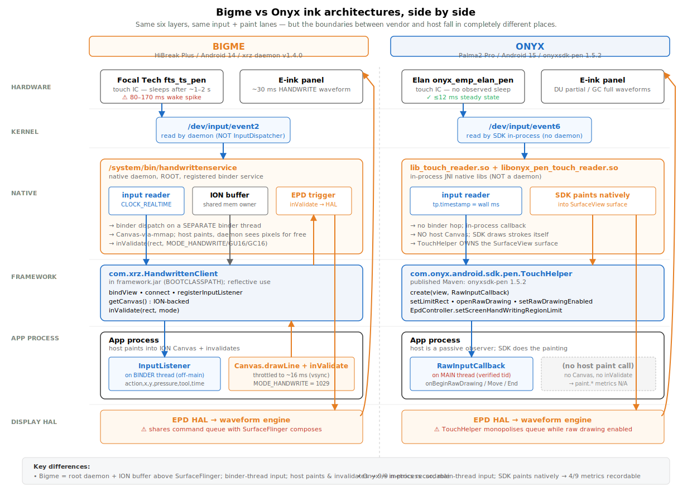

# Two ways to draw on e-ink: Bigme vs Onyx

*Architectural comparison and benchmark report from building the same low-latency ink pipeline on two devices that solved the same problem in completely different ways.*

---

This post sits next to [`bigme-sdk-reverse-engineered.md`](bigme-sdk-reverse-engineered.md) — that one is the story of finding the Bigme API; this one is the story of building the cross-vendor library on top of two APIs and learning that the architectures differ in ways that matter all the way up to user-perceptible latency.

The library, [`inksdk`](..), exposes one Kotlin interface — `InkController` — and ships two implementations: `BigmeInkController` (Bigme's `com.xrz.HandwrittenClient` daemon) and `OnyxInkController` (Onyx's `TouchHelper` SDK). Both deliver sub-30 ms first-paint when used correctly. They get there through entirely different mechanisms. Below: how each one actually works, what surprised us when we built and benchmarked them, and what hosts need to know to avoid the failure modes we hit.

---

## tl;dr — the shape of the difference



[Source: `eink-pen-architectures.svg`](eink-pen-architectures.svg). Six layers (hardware → kernel → native → framework → app → display HAL) drawn for both vendors at the same vertical positions, so the boundaries between vendor and host become visible at a glance: Bigme's daemon owns input + ION buffer + EPD trigger and hands the host a real Canvas to paint into; Onyx's in-process SDK owns the SurfaceView and paints natively, leaving the host as a passive observer of the `RawInputCallback`.

Both devices give you fast ink. The mechanisms diverge enough that "the same library code" doesn't get you there — the host has to know which compositor model it's working under. The full per-property comparison (input thread, surface model, paint observability, metric coverage, perf-pathology magnitudes) is in the [Side by side](#side-by-side) table further down.

---

## The shared problem

E-ink pixels are slow. A typical `MODE_HANDWRITE` waveform on these panels takes 30–40 ms to flip from one grey level to another, and a generic Android refresh path goes through `SurfaceFlinger`, which expects the framebuffer to be cheap to compose. On a 60 Hz LCD that's true; on an e-ink panel that's a 16 ms vsync budget against a 35 ms display update. `View.invalidate()` becomes the slowest call in your hot loop.

Every serious e-ink Android device ships a vendor-specific **bypass path** for the pen pipeline: instead of going through the normal compose-and-refresh dance, the stylus driver pushes ink directly into a buffer the EPD controller reads from. The host app's drawing happens "above" SurfaceFlinger; the visible ink appears "below" it. Latency drops from ~150 ms to ~30 ms.

The two vendors built that bypass differently. Onyx documented theirs; Bigme didn't.

---

## Architecture 1: Bigme — daemon + ION buffer + binder

The Bigme HiBreak Plus runs a native daemon called `handwrittenservice`. It binds to `/dev/input/event2` directly, allocates an [ION buffer](https://lwn.net/Articles/480055/) sized to the host SurfaceView, exposes that buffer as a `Canvas` over binder, and provides an `inValidate(Rect, mode)` call that pushes a refresh request to the EPD waveform engine.

The framework-side wrapper is `com.xrz.HandwrittenClient`, which lives in `framework.jar` (BOOTCLASSPATH-reachable from any app via reflection). The full API was reverse-engineered in the previous post; the canonical lifecycle from a host's point of view:

```kotlin
// 1. Construct + bind
val client = HandwrittenClient(context)
client.bindView(surfaceView)

// 2. Wire input
client.registerInputListener(object : HandwrittenClient.InputListener {
    fun onInputTouch(action, x, y, pressure, tool, time): Int {
        // fires on a binder thread when the daemon reads /dev/input
    }
})

// 3. Connect (allocates ION buffer at view dims)
client.connect(view.width, view.height)

// 4. Enable
client.setInputEnabled(true)
client.setOverlayEnabled(true)

// 5. In the input callback: paint and refresh
val canvas = client.getCanvas()  // ION-backed Canvas
canvas.drawLine(lastX, lastY, x, y, paint)
client.inValidate(dirtyRect, MODE_HANDWRITE)  // push to EPD
```

The daemon does three jobs in parallel:

1. **Reads kernel input events** from `/dev/input/event2` directly, bypassing the Android `InputDispatcher`. This is why Bigme's first-event latency can be excellent when the touch IC is awake.
2. **Owns the ION buffer.** When the host calls `getCanvas()`, the returned Canvas is hardware-backed by the same shared memory the EPD controller reads from. Drawing into it is a memcpy, not a SurfaceFlinger compose.
3. **Drives the EPD waveform engine** via `inValidate`. The mode argument (`MODE_HANDWRITE`, `MODE_GU16`, `MODE_GC16`) selects the waveform — handwrite is the fastest, ~30 ms; GU16 is a clean 16-grey-level update; GC16 is a full-flash global refresh.

**Key architectural property:** the ION buffer floats above SurfaceFlinger. The host's SurfaceView still gets composed normally — text, buttons, status widgets all work — and the daemon's overlay paints on top of that compose at the EPD layer. Two compositors share one panel.

That sharing is also where the trouble starts.

---

## Architecture 2: Onyx — TouchHelper + native rendering + EpdController

Onyx ships a documented Pen SDK in two public artifacts: `onyxsdk-pen` (the `TouchHelper` class) and `onyxsdk-device` (low-level `EpdController` access). The headline class is `com.onyx.android.sdk.pen.TouchHelper`, used like this:

```kotlin
val helper = TouchHelper.create(view, object : RawInputCallback() {
    override fun onBeginRawDrawing(b: Boolean, tp: TouchPoint) { ... }
    override fun onRawDrawingTouchPointMoveReceived(tp: TouchPoint) { ... }
    override fun onEndRawDrawing(b: Boolean, tp: TouchPoint) { ... }
}).apply {
    setStrokeWidth(3f)
    setStrokeStyle(TouchHelper.STROKE_STYLE_PENCIL)
    setStrokeColor(Color.BLACK)
    setLimitRect(rect, emptyList())
    openRawDrawing()
    setRawDrawingEnabled(true)
}

EpdController.setScreenHandWritingRegionLimit(view)
```

Then... that's it. The SDK paints the strokes itself. The `RawInputCallback` is informative — you find out a stroke happened — but you don't paint anything. There is no "Canvas" you can draw into. The pixels show up on the panel; you're notified after the fact.

**Architecture under the hood** (visible from `lib_touch_reader.so` loading, `EinkHelper.initImpl` timing in the logs, and the `setScreenHandWritingRegionLimit` call):

1. **TouchHelper opens `/dev/input/event*` directly** in process. (We see `lib_touch_reader: find path /dev/input/event6 result name onyx_emp_elan_pen` in our logcat captures.) No vendor daemon, no binder hop.
2. **Raw drawing renders inside the SDK** in native code, into the SurfaceView's surface buffer. The vendor SDK becomes the SurfaceView's renderer for the duration of `openRawDrawing` / `setRawDrawingEnabled(true)`.
3. **`EpdController` programs the EPD HAL directly.** When ink is drawn, the SDK calls down to the EPD HAL with a fast partial-update waveform; the call goes via JNI, not via SurfaceFlinger.

**Key architectural property:** while raw drawing is enabled, TouchHelper **owns the SurfaceView's surface** — and the EPD waveform engine is monopolised. SurfaceFlinger's composes (button presses, text changes, animations) are still happening in the view tree, but they don't make it to the panel. Only the ink renders.

This is dramatically simpler than Bigme's approach. It's also more total-control: no second compositor to coexist with. As we'll see below, that simplicity makes Onyx more predictable but also more fragile in a different direction.

---

## Side by side

| | Bigme | Onyx |
|---|---|---|
| API discoverability | undocumented; reflection only | published Maven artifacts |
| Native subsystem | root daemon (`handwrittenservice`) | in-process `.so` (`lib_touch_reader.so`) |
| Input pickup | daemon reads `/dev/input/event2` | SDK reads `/dev/input/event6` |
| Input delivery thread | binder thread (separate) | **main thread** |
| Surface model | independent ION buffer above SurfaceFlinger | TouchHelper owns the SurfaceView surface |
| Painting | host paints into ION-backed Canvas | vendor SDK paints in native code |
| EPD trigger | host calls `inValidate(rect, mode)` | SDK calls EPD HAL internally |
| `Canvas.mBitmap` mirror? | possible (HiddenApiBypass needed) | n/a (no host Canvas) |
| Coexisting view-tree refresh | yes (independent compositors) | no (waveform engine monopolised) |
| First-stroke wake cost | 80–170 ms (touch-IC sleep) | not observed (≤ 12 ms) |
| 30 Hz UI cadence cost | catastrophic (1062 ms p95) | mild (28 ms p95) |
| `TouchPoint.timestamp` epoch | CLOCK_REALTIME (wall ns) | `System.currentTimeMillis()` (wall ms) |

---

## What we measured — and what surprised us

The library's perf-counter system records nine metrics across three tiers (`pen.*` per stroke, `event.*` per binder event, `paint.*` per draw segment); see [`metrics.md`](metrics.md). Below is what came out of running the same demo (a 30-second timed bench, free-hand writing) on each device.

### Surprise 1: touch-IC sleep wake is Bigme-specific

The single biggest perceived-latency outlier on Bigme is what the library logs as `SLOW_STROKE`: a stroke whose first paint takes 80–170 ms even though steady-state is 5–10 ms. We initially thought it was a one-shot cold-launch effect; mid-session benchmarks proved otherwise.

The root cause turned out to be the touch IC's sleep state. After ~1–2 seconds with nothing near the panel, the Focal Tech `fts_ts_pen` controller drops into a low-sample-rate sleep mode. Physical capacitive proximity (a stylus 1–2 cm above the screen) wakes it; software `inValidate` calls cannot. We tried every JVM-driven daemon call we could think of — `setOverlayEnabled` toggles, 1×1 invalidates with HANDWRITE mode, raw input event subscription. None of them wake the touch IC. The xrz daemon doesn't dispatch hover events to the InputListener under any configuration.

So writing on Bigme has a per-burst tax: the first stroke after each natural pause pays the wake-up cost. A user writing continuously feels Bigme as fast; a user that pauses to think feels intermittent ~100 ms lag.

We expected to find the same on Onyx. Same e-ink panel manufacturer, same touch IC family, same physical geometry — should be the same physics. We did not find the same. Across 9 strokes with natural pauses (deliberately punctuated by 2–3 s gaps), Onyx's `pen.kernel_to_jvm` stayed under 12 ms with worst-case 12 ms and median 4 ms. There were no SLOW_STROKE events at the 30 ms threshold.

We don't fully know why. Possibilities:
- The Palma2 Pro uses a different touch controller (the device exposes `onyx_emp_elan_pen`, an Elan pen IC, not the FTS family Bigme ships).
- Onyx may keep the touch IC awake via a sysfs config knob during raw drawing.
- Onyx's `lib_touch_reader.so` might poll the IC at a steady rate that prevents sleep.

The library doesn't try to "fix" Bigme's touch-IC sleep — sysfs at `/sys/bus/i2c/drivers/fts_ts/` is permission-denied without root, and the relevant `vendor.*` system properties are SELinux-protected from `setprop`. The right answer for Bigme hosts is to surface the failure mode clearly in a `SLOW_STROKE` log line so they can correlate with user complaints, and to recognise that the touch-IC pathology lives below the Android stack.

### Surprise 2: UI redraws degrade dispatch on both — for different reasons

The "don't update non-canvas UI during writing" rule is well-known in e-ink-app land. We assumed it would hold equivalently on both devices. It does — but the failure modes are not equivalent.

We measured both with the same demo, the same writing pace, the same controller, sweeping the demo's countdown TextView at three cadences (off, 1 Hz, 30 Hz). Headline numbers:

```
              event.kernel_to_jvm p95
              ───────────────────
              Bigme           Onyx
1 Hz          11 ms           2 ms
30 Hz         1062 ms         26 ms          (40× milder on Onyx)
```

The Bigme p95 going from 11 ms to 1062 ms at 30 Hz is the kind of result that makes you re-run the test three times to be sure. It's real. Writing at 30 Hz timer cadence on Bigme is genuinely unusable; every input event lands behind ~430 ms of queued contention.

The mechanism on Bigme: each TextView text change triggers `View.invalidate` → Choreographer `doFrame` → SurfaceFlinger compose request via binder → EPD waveform queue write → HAL command-queue commit. Those steps serialise on the same kernel resources the xrz daemon's input dispatch uses. Two producers, one queue. Cost scales linearly with cadence (rules out GC pauses; would be cadence-independent) and binder threads run independently of the host main thread (rules out main-thread blocking). It's contention for the EPD/HAL command queue between SurfaceFlinger composes and the daemon's input-event dispatch.

The mechanism on Onyx is different. Onyx's RawInputCallback fires on the main thread (we verified by logging the thread ID — same tid as the activity's main thread). Choreographer ticks at 30 Hz steal main-thread time slices the input callback would otherwise run in. The view-tree work itself (View.invalidate → doFrame) is the cost — and it costs even though TouchHelper monopolises the EPD waveform engine and **no view-tree update visibly lands on the panel during writing**. The CPU work to prepare those (invisible) updates still happens.

Two devices, two architectures, same rule for hosts: don't update non-canvas UI while the user is writing. The only difference is how badly you'll be punished if you do.

### Surprise 3: surface ownership wedges Onyx in ways Bigme cannot

The library was originally designed against Bigme. The `InkSurfaceView` host pattern was: track strokes in a host bitmap, mirror the daemon's overlay onto it via `mirrorOverlay()`, and at stroke-end commit the bitmap back to the SurfaceView via `holder.lockCanvas()`. This works on Bigme because the daemon and SurfaceFlinger are independent compositors — both can hold the surface and they don't conflict.

We ported the same code to Onyx. The first stroke on Onyx **wedged the entire app**. The CountDownTimer froze (no more "29s left, 28s left"); the demo stopped responding to touches; only `adb` could recover it.

The diagnosis took longer than it should have because the symptom looked like an EPD refresh problem (a topic we'd been deep in for hours). The actual problem was simple once we caught it: `holder.lockCanvas()` from the stroke-end callback was blocking forever on the surface lock that **TouchHelper holds for the duration of raw drawing**. The vendor input thread (which is the main thread on Onyx, see Surprise 2) wedged in `lockCanvas`; SurfaceFlinger composes that the rest of the UI depends on couldn't proceed; the timer that fires on the main thread couldn't tick.

The fix was a new boolean on the controller interface:

```kotlin
interface InkController {
    /** True iff the overlay owns the host SurfaceView's surface while
     *  active — i.e. the host MUST NOT call `holder.lockCanvas()` /
     *  `unlockCanvasAndPost()` while writing. */
    val ownsSurface: Boolean get() = false
}
```

Onyx returns `true` when active; Bigme and the no-op fallback return `false`. The `InkSurfaceView` host gates every `commitToSurface()` call on `!ink.ownsSurface`. With that guard, Onyx benchmarks run cleanly to 30 s.

The architectural lesson: Bigme's "two independent compositors" model is more permissive than Onyx's "vendor SDK owns one compositor" model. Code written for Bigme will tend to deadlock on Onyx. Code written for Onyx will tend to leave EPD ghost trails on Bigme (because the daemon's ION buffer doesn't auto-clear and host-side surface commits are the only way to get canonical pixels in front of the user). The interface needs to flag both modes explicitly.

### Surprise 4: timestamp epoch differs — reflection-style auto-detection works

On Bigme, the daemon's `onInputTouch(..., time)` 6th argument is a `CLOCK_REALTIME` value in nanoseconds. We knew this from the reverse-engineering work and used it for the `event.kernel_to_jvm` metric directly: `System.currentTimeMillis() * 1_000_000 - daemonNs`.

On Onyx, the SDK's `TouchPoint.timestamp` field is also a wall-clock value — but in milliseconds, not nanoseconds, and matching `System.currentTimeMillis()` rather than `CLOCK_REALTIME` (which on Android is the same epoch but different resolution; here, just match the units). We initially assumed it was `SystemClock.uptimeMillis()` because the `MotionEvent`-based constructor implies that. The first benchmark dump on Onyx showed `pen.kernel_to_jvm` and `event.kernel_to_jvm` both with `n=0` — every dispatch sample was being silently dropped because `uptimeMillis - wallMillis` is wildly negative.

The fix: probe both clocks on the first valid event, log the deltas, and lock onto whichever produces a positive small value:

```kotlin
private fun recordDispatch(tp: TouchPoint, metric: PerfMetric) {
    val tsMs = tp.timestamp
    if (tsMs <= 0L) { /* unsupported firmware: log + disable */ }
    if (dispatchEpoch == DispatchEpoch.UNKNOWN) {
        val uptimeNow = SystemClock.uptimeMillis()
        val wallNow = System.currentTimeMillis()
        val uptimeDelta = uptimeNow - tsMs
        val wallDelta = wallNow - tsMs
        Log.i(TAG, "dispatch probe: tp.ts=$tsMs uptimeDelta=${uptimeDelta}ms wallDelta=${wallDelta}ms")
        dispatchEpoch = when {
            uptimeDelta in 0L..60_000L -> DispatchEpoch.UPTIME
            wallDelta in 0L..60_000L -> DispatchEpoch.WALL
            else -> DispatchEpoch.UNAVAILABLE
        }
    }
    val deltaMs = when (dispatchEpoch) {
        DispatchEpoch.UPTIME -> SystemClock.uptimeMillis() - tsMs
        DispatchEpoch.WALL -> System.currentTimeMillis() - tsMs
        else -> return
    }
    PerfCounters.recordDirect(metric, deltaMs * 1_000_000L)
}
```

The probe on the Palma2 Pro logged:

```
dispatch probe: tp.ts=1777187882884 uptimeNow=14660790 wallNow=1777187882894
                uptimeDelta=-1777173222094ms wallDelta=10ms
dispatch epoch locked: WALL
```

Locked to WALL. Subsequent benches recorded clean numbers. The auto-detect adds zero cost after the first event.

This is the kind of compatibility shim that becomes inevitable when you write portable code against undocumented vendor behaviour. The test apparatus had to be more defensive than we expected. We wouldn't be at all surprised to find a third Onyx firmware that ships a different epoch again — the auto-detect approach lets the library survive that.

### Surprise 5: visible UI refresh during writing is impossible on Onyx, easy on Bigme

A purely UX-level discovery, but worth calling out because it shaped our bench harness.

The demo has a countdown timer and a status TextView. On Bigme during writing, the countdown ticks visibly: "29s left, 28s left, 27s left." It's slightly choppy because the EPD refresh queue is busy, but it works.

On Onyx during writing, the countdown text **does not visibly change**. The TextView's `text` property updates in the view tree (we know this because `CountDownTimer.onFinish` fires correctly after 30 s), but the panel pixels stay frozen at whatever the TextView showed when raw drawing started. We tried four things in escalating order:

1. `EpdController.invalidate(view, UpdateMode.DU)` — blocking call that hangs while raw drawing is active.
2. `EpdController.postInvalidate(view, UpdateMode.DU)` — non-blocking, returns immediately, but the invalidate gets coalesced with the SurfaceView's pending refresh, which never lands.
3. `EpdController.refreshScreen(view, UpdateMode.DU)` on a background HandlerThread — calls down to the EPD HAL but the call queues behind the active raw-drawing waveform and doesn't visibly land.
4. `setRawDrawingEnabled(false)` momentarily — works, but kills ink fluidity for the duration.

The conclusion: while TouchHelper has raw drawing enabled, **nothing else is allowed to refresh the panel.** The EPD waveform engine has one active "owner" and the host can't interleave updates without taking ownership away.

Our bench harness now pauses raw drawing (`setRawDrawingEnabled(false)`) at `stopBenchmark` so the perf-overlay screen actually becomes visible, and resumes it when the user dismisses the overlay. That's the right pattern for any app that wants to show modal UI after writing: pause first, refresh, re-enable when ready.

### Side note: metric coverage gap is unavoidable

The `inksdk` perf-counter system defines nine metrics. On Bigme we record all nine. On Onyx we record four:

```
                              Bigme   Onyx
pen.kernel_to_paint            ✅      ❌  no JVM-observable paint moment
pen.kernel_to_jvm              ✅      ✅
pen.jvm_to_paint               ✅      ❌  same
pen.jvm_to_first_move          ✅      ✅
pen.move_to_paint              ✅      ❌  same
event.kernel_to_jvm            ✅      ✅
event.handler                  ✅      ✅
paint.draw_segment             ✅      ❌  no host-side draw call
paint.invalidate_call          ✅      ❌  no host-side invalidate
```

This is not a library deficiency; it's an architectural property. Onyx's paint happens inside the vendor SDK's native code — there is no JVM moment to bracket. The ten gauges that the headline `pen.kernel_to_paint` decomposes into on Bigme have no equivalent on Onyx, period.

The library exposes this gracefully: all nine `PerfMetric` enum entries always exist; uncreated samples report `count=0`; hosts iterate `PerfCounters.snapshot()` without per-controller branching. The perf overlay falls back from `pen.kernel_to_paint` (Bigme headline) to `pen.kernel_to_jvm` (Onyx proxy headline) when the former has no samples.

---

## What this means for app developers

If you're writing a notes app that needs to support both Bigme and Onyx, the architectural differences above translate to a small set of MUSTs:

1. **Use a controller abstraction, not direct vendor SDK calls.** Your app shouldn't know which vendor's pipeline is active. The `InkController` interface in this repo is one shape; you can write your own. The interface needs three flags at minimum: `consumesMotionEvents`, `ownsSurface`, and `isActive`. Without those flags you'll either deadlock on Onyx or leak ink ghosts on Bigme.

2. **Don't refresh non-canvas UI during writing.** This is a hard rule on both devices, just with different sharpness:
   - On Bigme, a 1 Hz status update inflates input dispatch p95 from 1 ms to 11 ms (mild, may be acceptable for some UX). A 30 Hz update (animations, progress bars) will inflate it to **1062 ms** (catastrophic, 40× worse). Every text change goes through SurfaceFlinger → binder → EPD HAL queue, and the daemon's input dispatch shares that queue.
   - On Onyx, a 30 Hz update inflates input dispatch p95 from 2 ms to 26 ms (perceptible, 13×). The mechanism is different (CPU contention with the main-thread input callback) but the rule is the same.
   - **Batch UI updates and flush them when the user pauses.** The `onStrokeEnd` callback is a natural flush point.

3. **On Onyx, never call `holder.lockCanvas()` while raw drawing is enabled.** Use the SDK's own paint path or stay out of the surface entirely. If you need to show post-write UI, pause raw drawing first via `setRawDrawingEnabled(false)`, render, then re-enable.

4. **On Bigme, expect first-stroke-after-pause spikes of 80–170 ms.** Surface them in your app's perf telemetry as `pen.kernel_to_paint p99` rather than p50/p95 — the per-pause wake hides in the long tail. Don't try to "warm" the touch IC with daemon calls; it doesn't work.

5. **Never assume `TouchPoint.timestamp` epoch.** If you need cross-clock latency math, probe both `SystemClock.uptimeMillis()` and `System.currentTimeMillis()` against the timestamp on the first event and lock onto whichever produces a sane delta.

6. **Detect controllers at runtime, not via build flavours.** Both controllers' `attach()` returns false on devices where the underlying API isn't available. The factory in `InkControllerFactory.create()` shows the right pattern: try Bigme, try Onyx, fall back to a no-op. One APK ships everywhere.

---

## What we'd build differently if we were vendors

Both vendors made reasonable choices. Both have failure modes we hit hard. If we were doing this from scratch, two things would be on the wishlist:

**For Bigme: dispatch input on a dedicated thread with a fixed-priority queue.** The current design's binder dispatch shares an EPD/HAL queue with SurfaceFlinger composes, which is what creates the 30 Hz pathology. A dedicated high-priority queue for input events — even with the same underlying transport — would isolate dispatch latency from app-level UI activity.

**For Onyx: dispatch input on a non-main thread.** Putting the `RawInputCallback` on the main thread means any main-thread CPU spike (Choreographer, GC pause, or just an over-busy app) competes with input dispatch. A dedicated callback thread (the way Bigme does it via binder) would isolate the two. The current design works fine for apps that follow the "no UI updates during writing" rule, but a noisier app pays a real cost.

Both vendors could also publish a hover/proximity event so apps can pre-warm the touch IC. Neither does.

---

## What we'd build differently in the library

Two things the inksdk experience taught us about API design for cross-vendor pipelines:

**Make the architectural model explicit in the interface.** We added `ownsSurface` after the fact, and we needed it as soon as we ported to Onyx. There's almost certainly a `dispatchesOnMainThread` flag missing too — the right time to add it is before someone builds a host that assumes binder-thread dispatch and gets bitten on Onyx. Better to have a small set of architectural shape flags on day one.

**Keep the metric enum complete even when controllers can't fill it.** It's tempting to make the metric enum vendor-specific (only emit the entries this controller can record). Don't. Hosts iterate, dashboards aggregate, and the sentinel-zero pattern (`count=0` for unrecorded metrics) is dramatically simpler than per-controller schemas. Cross-vendor tools consume the union of metrics; let them.

---

## Closing

The headline finding is the gap between architectures, not between devices. Bigme and Onyx both ship fast pen pipelines, but their architectures are different enough that the same library has to know which model it's working under. Surface ownership, dispatch threads, the existence of a JVM-observable paint moment — those are *interface-level* differences, not implementation details. They affect what a host can safely do during a stroke.

The library survives both. It does so by carrying a small amount of model state (`consumesMotionEvents`, `ownsSurface`) on the interface and letting the host gate its surface and view operations on those flags. Once that's in place, the same demo runs cleanly on both devices and produces directly comparable perf numbers. Numbers that, side by side, tell a more interesting story than either alone:

- Bigme's first-stroke wake is real and Onyx doesn't have it.
- Both devices punish concurrent UI updates during writing, with very different magnitudes.
- The architectural difference between "two compositors" (Bigme) and "one vendor-owned compositor" (Onyx) shows up at every level — surface ownership, dispatch scheduling, refresh model, available metrics.

If you're building an e-ink app that wants to support both vendors: use a controller abstraction, expose the architectural flags, and follow the host-side discipline rules above. If you're building only for one vendor, you can skip a lot of this — but it's worth knowing the other side exists, because users who try your app on the other vendor's hardware will have a sharp opinion about whether you got it right.

If you're a vendor: please give us hover events. We can take it from there.
