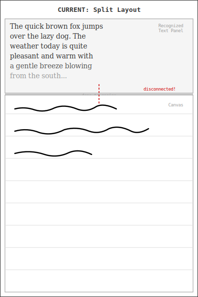
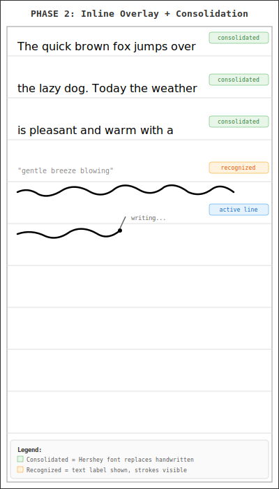
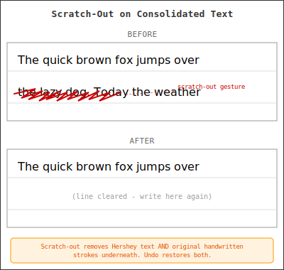
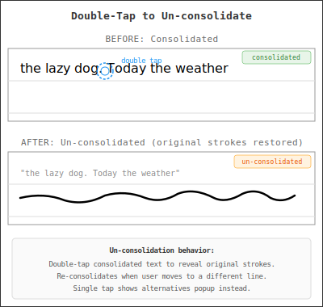
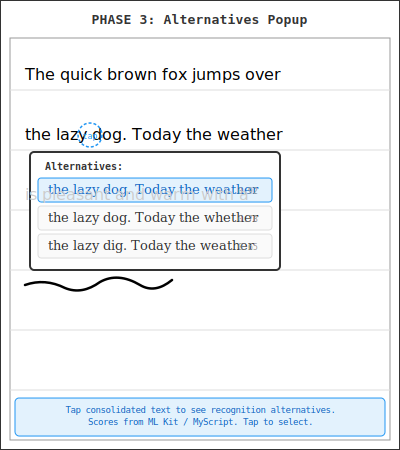
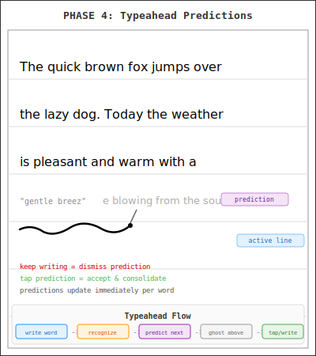

# Inline Text Recognition Overlay — Design Document

*Draft · March 2026*

---

## UX Illustrations








---

## Problem

The current recognized text display is a separate `RecognizedTextView` panel above the canvas, connected via `SplitLayout`. This creates two problems:

1. **Disconnected experience** — the user writes on the canvas but reads text in a physically separate area. There's no spatial connection between handwritten strokes and their recognized text.
2. **Performance** — `DisplayManager` rebuilds `StaticLayout` objects on every scroll frame, causing jagged scrolling on e-ink.

## Solution

Replace the text panel with **inline text overlays** rendered directly on the canvas. Recognized text appears above the handwritten strokes on each line. When the user moves to the next line, previous lines consolidate: the handwritten strokes are visually replaced by compact Hershey font text while the originals are preserved in storage. Users can interact with the overlay to select among recognition alternatives, and eventually see typeahead predictions.

---

## Design Principles

1. **Original strokes are always preserved** — consolidation is purely a rendering change. Handwritten strokes remain in `ColumnModel.activeStrokes` and are serialized to disk. Synthetic Hershey strokes are transient and regenerated from `lineTextCache` on load. Document history/versioning will be enhanced to let users go back in time and recover original handwriting even after scratch-out.

2. **Consolidated text is scratchable (one-step)** — scratch-out and strikethrough gestures work on consolidated Hershey text exactly as they do on handwritten strokes. Erasing consolidated text removes both the synthetic display strokes and the underlying original strokes in a single gesture. The safety net is the document version history, not multi-step deletion.

3. **No mode switching** — the overlay appears automatically as the user writes. No buttons or toggles needed.

4. **E-ink friendly** — no antialiasing, no frequent full refreshes. Hershey strokes render the same way as normal strokes (same paint, same pipeline).

5. **Finger taps are Layer 3 composition actions** — per the Two Instruments model, the finger never creates content during capture (Layer 1). However, tapping to select recognition alternatives or accept typeahead predictions are post-capture composition actions (Layer 3). This is an intentional, documented departure: the finger edits *recognized text*, not raw strokes. The stylus remains the sole instrument for creating strokes.

6. **Low-confidence alternatives shown inline** — when recognition confidence is low, alternative candidates are shown inline directly on the canvas (e.g. "weather | whether") rather than hidden behind a tap. This makes the uncertainty visible and discoverable without requiring the user to guess that interaction is available.

7. **Un-consolidated state is visually distinct** — when a consolidated line is double-tapped to reveal original handwriting, a visible border marks the expanded region so the user doesn't need to track invisible state.

---

## Phased Implementation

### Phase 1: Full-Screen Canvas

Remove the `RecognizedTextView` panel and `SplitLayout`. The canvas takes full screen height.

**What changes:**
- `activity_writing.xml`: Remove `RecognizedTextView`, `splitDivider`. Canvas gets `match_parent` height.
- `WritingActivity.kt`: Remove text view fields, split resize logic, text scroll wiring.
- `WritingCoordinator.kt`: Remove `textView` constructor parameter.
- `DisplayManager.kt`: Remove `textView` parameter and all `updateTextView()`/`setContent()` calls.
- `ScreenMetrics.kt`: Remove `computeDefaultCanvasHeight()` and `canvasFraction`.
- Tutorial: Remove text view references (close button, scroll hint, status text).

**What gets deleted:**
- `view/RecognizedTextView.kt`
- `view/SplitLayout.kt`
- `view/PreviewLayoutCalculator.kt`

---

### Phase 2: Inline Text Overlay + Consolidation

Recognized text appears on the canvas. Previous lines show Hershey font text instead of handwritten strokes.

#### Data Model

```kotlin
// New file: ui/writing/InlineTextOverlay.kt
data class InlineTextState(
    val lineIndex: Int,
    val recognizedText: String,
    val consolidated: Boolean,              // true = show Hershey text, hide handwritten
    val unConsolidated: Boolean = false,    // true = double-tapped, showing originals with border
    val syntheticStrokes: List<InkStroke>,   // Hershey-generated (empty until consolidated)
    val candidates: List<RecognitionCandidate> = emptyList(),  // Phase 3: alternatives
    val lowConfidence: Boolean = false,     // Phase 3: true = show inline alternatives
)
```

#### Canvas Rendering

New layers added to `HandwritingCanvasView.renderContent()`:

```
1. Clear white background
2. Scroll transform
3. Ruled lines
4. Consolidated Hershey text strokes ← NEW (drawn where handwritten strokes were)
5. Unconsolidated text labels ← NEW (drawText() ABOVE the line, showing recognized text)
6. Completed strokes (skip consolidated lines)
7. Ghost strokes (tutorial/typeahead)
8. In-progress stroke
9. Dwell indicator
10. Diagram borders
```

`HandwritingCanvasView` gains:
- `var inlineTextOverlays: Map<Int, InlineTextState>` — set by DisplayManager
- `var consolidatedLineIndices: Set<Int>` — derived from overlays for O(1) lookup in stroke loop
- `var onOverlayTap: ((lineIndex: Int) -> Unit)?` — single tap callback (shows alternatives popup)
- `var onOverlayDoubleTap: ((lineIndex: Int) -> Unit)?` — double tap callback (un-consolidates the line, showing original handwritten strokes again)

#### Consolidation Rules

Consolidation happens **immediately** when the user starts writing on the next line. When `currentLineIndex` advances to line N, consolidate line N-1:

1. Look up `lineTextCache[N-1]`
2. Generate Hershey strokes: `hersheyFont.textToStrokes(text, leftMargin, lineY, scale, jitter=1f)`
3. Scale: `LINE_SPACING * 0.45f / HERSHEY_CAP_HEIGHT` (fill ~45% of line height)
4. Set `InlineTextState(consolidated=true, syntheticStrokes=...)`
5. Original handwritten strokes stay in `ColumnModel` — only skipped during rendering

On document load: re-derive consolidation from `lineTextCache` — any line with cached text and `lineIndex < currentLineIndex` is consolidated.

#### Scratch-Out / Strikethrough on Consolidated Lines

Gestures drawn over Hershey text work identically to gestures on handwritten strokes:

- Overlap detection runs against the synthetic Hershey strokes (what's actually rendered)
- When a scratch-out or strikethrough hits a consolidated line:
  - Save undo snapshot (same as normal scratch-out)
  - Remove the underlying original handwritten strokes from `ColumnModel.activeStrokes`
  - Clear `lineTextCache` entry for that line
  - Remove the `InlineTextState` for that line
  - The line is now empty — user can write on it again

#### Undo

- Undo restores the previous snapshot (which contains the original strokes)
- Consolidation state is re-derived from `lineTextCache` + `currentLineIndex`
- No special undo handling needed — consolidation is derived, not stored

#### StrokeType

Add `SYNTHETIC` to the `StrokeType` enum. Hershey-generated strokes use `strokeType = StrokeType.SYNTHETIC`. This lets the system distinguish them from handwritten strokes for serialization filtering and recognition exclusion.

---

### Phase 3: Recognition Alternatives

User taps an inline text label → popup shows alternative recognition candidates. User picks one → text and consolidation update.

#### Recognition API Changes

```kotlin
// New types in recognition/TextRecognizer.kt
data class RecognitionCandidate(val text: String, val score: Float?)
data class RecognitionResult(val candidates: List<RecognitionCandidate>)

interface TextRecognizer {
    suspend fun initialize(languageTag: String)
    suspend fun recognizeLine(line: InkLine, preContext: String = ""): String
    suspend fun recognizeLineWithCandidates(
        line: InkLine, preContext: String = ""
    ): RecognitionResult {
        // Default: wrap single result from recognizeLine()
        return RecognitionResult(listOf(RecognitionCandidate(recognizeLine(line, preContext), null)))
    }
    fun close()
}
```

#### ML Kit Candidates

`GoogleMLKitTextRecognizer` overrides `recognizeLineWithCandidates()`:
- Returns all candidates from `result.getCandidates()`
- Each has `getText(): String` and `getScore(): Float?` (verified available in API)
- Increase `PRE_CONTEXT_LENGTH` from 20 to 200 for better contextual prediction

#### MyScript Candidates (Onyx HWR)

MyScript supports candidates via its recognition API. The current AIDL integration only parses `result.label` from the JSON response (`HwrProtobuf.parseHwrResult()`).

**Discovery step**: Log the full JSON response from `OnyxHwrTextRecognizer` to discover the candidate field structure. Expected format based on MyScript API:
```json
{"result":{"label":"text","candidates":[{"label":"alt1","score":0.95}, ...]}}
```

Then add `HwrProtobuf.parseHwrResultWithCandidates(json): RecognitionResult` to extract all candidates.

#### Alternatives UX

`InlineTextState` gains `candidates: List<RecognitionCandidate>`.

**Inline alternatives (low confidence):**
When the top candidate's score is below a confidence threshold (e.g. 0.8), alternatives are shown **inline** directly on the consolidated/label text. For example, a word with low confidence renders as `"weather | whether"` with a pipe separator. Tapping an inline alternative selects it — the text updates and the alternatives disappear. This makes uncertainty visible and discoverable without requiring the user to guess that interaction exists.

**Popup alternatives (high confidence):**
- **Single tap** on overlay text fires `onOverlayTap(lineIndex)` → shows full alternatives popup for manual correction
- Activity shows a `PopupWindow` anchored at the line position with candidate rows (same pattern as existing menu popup)
- On selection: update `lineTextCache`, regenerate Hershey strokes, dismiss popup
- Single-candidate lines: show "Re-recognize" option

**Un-consolidation:**
- **Double tap** on consolidated text fires `onOverlayDoubleTap(lineIndex)` → un-consolidates the line (shows original handwritten strokes, hides Hershey text)
- A visible **border** marks the un-consolidated region so the state is not invisible
- The line re-consolidates when the user moves to a different line

---

### Phase 4: Typeahead Predictions (stretch)

Show predicted next words **above the active writing line** as gray ghost Hershey strokes. Predictions appear **immediately as each word is recognized** — no pause required.

- After each word is recognized on the current line, build extended `preContext` from all consolidated lines + current line text
- Use recognizer or bigram model to predict likely next words
- Generate ghost Hershey strokes positioned **above the current writing line** (same position as the unconsolidated text label, but as gray Hershey strokes extending beyond the recognized text)
- Render using existing ghost stroke infrastructure (gray paint, `ghostStrokes` field)
- On `beginStroke()` near ghost strokes: clear them (prediction rejected by writing)
- On tap of ghost strokes: accept as synthetic consolidated text
- Accepted predictions generate `SYNTHETIC` strokes that are added to `ColumnModel`
- Predictions update continuously as the user writes — each new recognized word triggers a fresh prediction

---

### Phase 5: Grammar-Aware Re-ranking (stretch)

Use sentence context to improve recognition accuracy:

- Android `SpellCheckerService` API to validate candidates against system dictionary
- Build simple trigram model from the document's own recognized text for re-ranking
- Combine recognition confidence with language model probability
- Auto-select highest-ranked candidate; allow override via alternatives popup

---

## Key Files

| File | Role in this feature |
|------|---------------------|
| `view/HandwritingCanvasView.kt` | Renders inline overlays, handles tap on consolidated text, skip consolidated strokes |
| `ui/writing/DisplayManager.kt` | Builds `InlineTextState` map, triggers consolidation on line changes |
| `ui/writing/WritingCoordinator.kt` | Owns `HersheyFont`, passes to DisplayManager, detects line changes |
| `ui/writing/WritingActivity.kt` | Wires overlay tap → popup, handles alternative selection |
| `recognition/TextRecognizer.kt` | New `recognizeLineWithCandidates()` API |
| `recognition/GoogleMLKitTextRecognizer.kt` | Extract ML Kit candidates + scores |
| `recognition/OnyxHwrTextRecognizer.kt` | Extract MyScript candidates from JSON |
| `recognition/HwrProtobuf.kt` | Parse MyScript candidate JSON |
| `ui/writing/HersheyFont.kt` | Generate synthetic strokes (no changes needed) |
| `model/StrokeType.kt` | Add `SYNTHETIC` enum value |
| `view/GestureHandler.kt` | Scratch-out/strikethrough detection against synthetic strokes |

## Risks & Mitigations

| Risk | Mitigation |
|------|-----------|
| Hershey font illegible at small LINE_SPACING (41dp on Palma 2 Pro) | Compute scale dynamically from LINE_SPACING; test on device; fall back to `Canvas.drawText()` if too small |
| Onyx SDK pause/resume for popup | Same pattern as existing menu popup — well-tested |
| Undo coherence with consolidation | Consolidation is derived state (from `lineTextCache` + `currentLineIndex`), not stored in undo stack |
| Scratch-out hitting synthetic vs original strokes | Overlap detection uses synthetic strokes (what's rendered); removal cascades to originals |
| MyScript JSON candidate format unknown | Discovery step: log full JSON before parsing |

## Resolved Design Decisions

| Question | Decision |
|----------|----------|
| Where does the inline text label appear? | **Above the line**, between the previous line and the current one |
| When does consolidation happen? | **Immediately** when the user starts writing on the next line |
| How to un-consolidate? | **Double tap** on consolidated text shows original handwritten strokes with a **visible border**. Re-consolidates when the user moves to a different line. |
| When do typeahead predictions appear? | **Immediately** as each word is recognized — no pause. Shown above the active writing line as gray ghost Hershey strokes. Will find ways to make less intrusive when writing on previous lines. |
| Scratch-out: one step or two? | **One step** — scratch-out deletes both Hershey text and original strokes. Safety net is enhanced document version history (go back in time), not multi-step deletion. |
| How are low-confidence alternatives shown? | **Inline** on the canvas (e.g. `"weather \| whether"`) — visible and discoverable without tapping. High-confidence lines use tap-for-popup instead. |
| What are finger tap interactions? | **Layer 3 composition actions** per the Two Instruments model. Finger edits recognized text (alternatives, predictions), never raw strokes. Stylus remains sole creator. |
