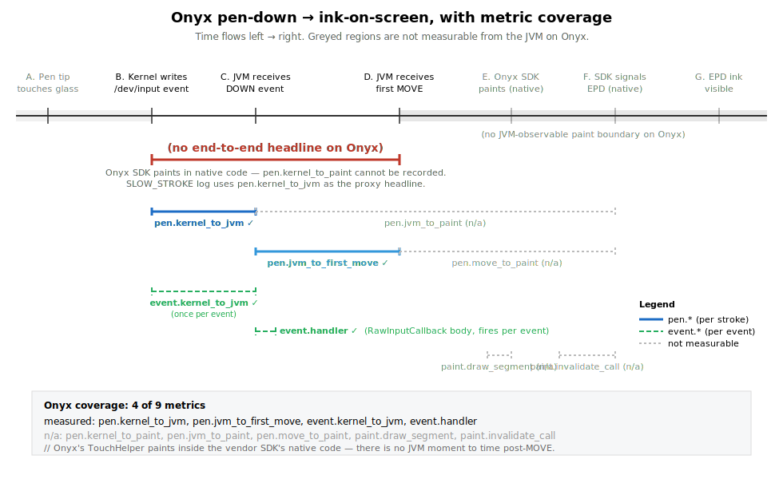

# inksdk perf counters

The library records latency at every stage of the pen-down → ink-on-screen
pipeline so we can isolate where time goes. All counters live in
`com.inksdk.ink.PerfCounters` and are recorded on the binder thread with no
allocations on the hot path.


The diagram above ([source](metrics-timeline.svg)) maps which event
boundaries each metric spans.

## Where the time actually goes

The full journey from pen tip touching glass to ink visible on the EPD has
seven measurable stages:

| | Stage | What happens |
|---|---|---|
| **A** | Pen tip on glass | Hardware contact. Not measurable from software. |
| **B** | Kernel input event | Touch IC samples, kernel writes `/dev/input` event. The xrz daemon reads this almost immediately and timestamps it (CLOCK_REALTIME, exposed via the binder callback's `args[5]`). We treat this daemon-read time as a stand-in for B. |
| **C** | JVM receives DOWN | The daemon dispatches the binder call; our `InputProxy.invoke` runs on a binder thread. |
| **D** | JVM receives first MOVE | The first `ACTION_MOVE` after `ACTION_DOWN`. This is the first event with anything paintable, since a line needs two points. |
| **E** | `drawLine` returns | We've painted the first segment into the daemon's ION-backed Canvas. |
| **F** | `inValidate` returns | We've told the daemon to push the dirty rect to the EPD. The daemon owns whatever happens after this. |
| **G** | EPD pixels visible | Daemon's waveform completes on the panel. Not measurable from the JVM — only a high-speed camera can capture it. The Bigme HiBreak Plus's `MODE_HANDWRITE` waveform takes ~30–40 ms. |

`A → B` and `F → G` are dark zones — counter values do not include them.
The library captures the entire `B → F` span: everything we can influence in
software.

## Counters

Three tiers, named by sample rate:

- **`pen.*`** — one sample per stroke. Captures the pen-down-to-paint
  experience. These are the latencies a user actually perceives.
- **`event.*`** — one sample per binder event. Captures dispatch and
  per-event JVM-side overhead.
- **`paint.*`** — one sample per draw segment (per `ACTION_MOVE`). Captures
  the actual draw + invalidate calls.

### `pen.*` (one sample per stroke)

| Name | Span (see SVG) | Definition |
|---|---|---|
| `pen.kernel_to_paint` | B → F | **Headline metric.** Wall-clock from kernel pen-down to first `inValidate` returning. The most direct answer to "how long until ink shows." |
| `pen.kernel_to_jvm` | B → C | Wall-clock from kernel pen-down to the DOWN event landing in `InputProxy.invoke`. Measures kernel + daemon + binder dispatch for the DOWN event only. |
| `pen.jvm_to_paint` | C → F | JVM-monotonic from DOWN landing in JVM to first `inValidate` returning. The pure software cost once the event is in the JVM. |
| `pen.jvm_to_first_move` | C → D | JVM-monotonic from DOWN to the first MOVE arriving. Includes (a) kernel + binder dispatch of the MOVE and (b) the user's actual pen-movement speed. **Do not interpret this as pure stack overhead** — a slow scribbler inflates the tail. |
| `pen.move_to_paint` | D → F | First MOVE landing in JVM → first `inValidate` returns. Pure JVM-side processing with no user-input contamination. The cleanest measure of "how fast can we render once we have something to render." |

Decomposition:

```
pen.kernel_to_paint  =  pen.kernel_to_jvm  +  pen.jvm_to_paint
pen.jvm_to_paint     =  pen.jvm_to_first_move  +  pen.move_to_paint
```

### `event.*` (one sample per binder event)

| Name | Definition |
|---|---|
| `event.kernel_to_jvm` | Wall-clock from the daemon's CLOCK_REALTIME timestamp to our `InputProxy.invoke` entry. Same as `pen.kernel_to_jvm` but recorded for **every** event, not just DOWN. Useful for spotting binder-thread starvation under sustained load. |
| `event.handler` | Full `InputProxy.invoke` wall time. Captures everything we do for one event: drawLine (on MOVE), inValidate (on first/throttled MOVEs and UP), accumulator updates, perf recording. |

### `paint.*` (one sample per draw segment)

| Name | Definition |
|---|---|
| `paint.draw_segment` | Wall time of one `Canvas.drawLine` into the daemon's ION buffer. |
| `paint.invalidate_call` | Wall time of one `client.inValidate(rect, mode)` binder round-trip. |

## How to read a snapshot

Each counter exposes `count`, `lastMs`, `p50Ms`, `p95Ms`, `maxMs`, and the
last `samples` list. Hosts call:

```kotlin
val s = PerfCounters.get(PerfMetric.PEN_KERNEL_TO_PAINT)
Log.i(TAG, "first-paint p50=${s.p50Ms}ms p95=${s.p95Ms}ms max=${s.maxMs}ms")
```

or dump everything:

```kotlin
for ((m, snap) in PerfCounters.snapshot()) {
    if (snap.count == 0L) continue
    Log.i(TAG, "${m.label}: count=${snap.count} p50=${snap.p50Ms}ms p95=${snap.p95Ms}ms max=${snap.maxMs}ms")
}
```

## Diagnostic playbook

When `pen.kernel_to_paint` p95 is high, the breakdown tells you where to
look:

| Symptom | Likely cause |
|---|---|
| `pen.kernel_to_jvm` high | Kernel/daemon/binder dispatch slow — usually binder thread contention from concurrent IPC, GC pauses, or CPU throttling. The daemon side is fine; *something* is delaying its callback into our JVM. |
| `pen.jvm_to_first_move` high (but `pen.move_to_paint` is fine) | Either MOVE-event dispatch is slow (same root causes as above) or the user just moves slowly. Cross-check with `event.kernel_to_jvm` — if that's also high, it's dispatch; if it's low, it's the human. |
| `pen.move_to_paint` high | Our drawLine + inValidate path is slow. Check `paint.draw_segment` vs `paint.invalidate_call` to localize. |
| `paint.invalidate_call` p95 high | Daemon is slow to ack the binder call. Could be panel waveform contention, daemon GC, or a stuck refresh queue. |
| All `pen.*` healthy but ink visibly lags | Stage F → G (EPD waveform). The daemon has accepted the request; the panel itself is slow to flip pixels. Not addressable from this library. |

## Custom prefix

`PerfCounters.prefix` defaults to `"ink."`. Hosts that want to merge our
counters into their own perf system can override it once at startup:

```kotlin
PerfCounters.prefix = "myapp.ink."
```

This affects `PerfMetric.label` for every metric (e.g.
`pen.kernel_to_paint` → `myapp.ink.pen.kernel_to_paint`).

## Touch-IC wake — the per-pause first-stroke cost

On the Bigme HiBreak Plus (Android 14, daemon v1.4.0) every stroke
**after the user has paused for ~1–2 seconds** pays an 80–170 ms
wake-up cost in `pen.kernel_to_jvm`, while subsequent strokes within the
same continuous-writing burst stay at 3–8 ms. The cost shows up
exclusively in dispatch:

```
pen.kernel_to_paint = 80–130 ms     # the headline number the user perceives
pen.kernel_to_jvm   = 78–129 ms     # ALL of it is dispatch
pen.jvm_to_paint    = 0–1 ms        # JVM-side processing is fine
```

This is NOT a one-time cold-launch cost. We initially thought so, then
caught it red-handed in mid-session benchmarks — for a 30-stroke run we
typically see 4–8 strokes hitting `≥ 80 ms` while every other stroke is
sub-10 ms. The `SLOW_STROKE` log line in `BigmeInkController` flags any
stroke with `pen.kernel_to_paint ≥ 30 ms` and timestamps it; the slow
strokes correlate with natural pauses in writing (between letters,
words, after a glance away).

**Cause** (verified empirically with the slim demo):

- The touch IC drops into a low-sample-rate sleep state when nothing is
  near the screen for ~1–2 seconds. Physical capacitive proximity (a
  stylus hovering 1–2 cm above the panel) wakes it. Continuous writing
  keeps it awake; lifting the pen all the way off the screen for a
  beat lets it re-enter sleep.
- The xrz `handwrittenservice` daemon **does not** dispatch hover /
  `ACTION_NEAR` events to the registered `InputListener` under any
  configuration we tried — neither the cooked path (with internal
  `convertXY`) nor the raw path (`setUseRawInputEvent(true)`).
- Therefore `inValidate(MODE_HANDWRITE)` on a 1×1 rect, `setOverlayEnabled`
  toggles, and any other JVM-driven daemon call **cannot warm the touch
  IC**. They reach the EPD waveform engine, which is the wrong subsystem.

**Implications:**

- A user writing continuously feels the device as fast — the wake fires
  only at the start of each writing burst. A user that pauses to think,
  glance away, or move between regions of the page will feel intermittent
  ~100 ms lag on the *first stroke after each pause*, several times per
  minute.
- The library exposes no `prewarm()` API. The historic `ACTION_NEAR`
  pre-warm pattern from xNote / Mokke is dead code on this firmware.
- For dashboards, focus on `pen.kernel_to_paint`'s `p99` and the
  `SLOW_STROKE` log count, not p50/p95 — the per-pause wake hides in the
  long tail.

If a future firmware starts dispatching `NEAR` to InputListener, the
controller would record a sample in `event.kernel_to_jvm` for it — that's
the signal to add a pre-warm path back.

## UI-compose stall during writing

On-screen redraws during active writing inflate `event.kernel_to_jvm`
on **both** controllers — but the mechanism and the cost differ
sharply. Both behaviours are real, both are per-update (not
per-time-window), and both push hosts toward the same discipline:
batch UI updates, flush them when the pen lifts.

### Bigme HiBreak Plus (Android 14, daemon v1.4.0)

Demo benchmark, same writing pace, same controller:

| | `event.kernel_to_jvm` p50 / p95 / max | `pen.kernel_to_paint` p50 / p95 / max |
|---|---|---|
| **No update** | 0 / 1 / 2 ms | 5 / 100 / 104 ms |
| **1 Hz** (per-second countdown) | 0 / 11 / 26 ms | 5 / 122 / 144 ms |
| **30 Hz** (frame-rate counter) | **430 / 1062 / 1078 ms** | **325 / 770 / 898 ms** |

At 30 Hz the dispatch path is saturated: every input event lands behind
~430 ms of queued contention, and writing becomes effectively unusable.
(`pen.jvm_to_paint` stays at p95 ≤ 4 ms in all three runs — once the
event reaches the JVM, processing is fine. The latency is all
dispatch.)

**Mechanism: EPD/HAL command queue contention.** Each text change →
View invalidate → Choreographer `doFrame` → SurfaceFlinger compose
request via binder → EPD waveform queue write → HAL command-queue
commit. Those steps serialize on the same kernel resources the xrz
daemon's input dispatch uses — both are producers into one queue. Cost
scales linearly with cadence (rules out GC pauses; would be cadence-
independent) and binder threads run independently of the host main
thread (rules out main-thread blocking).

### Onyx Palma2 Pro (Android 15, onyxsdk-pen 1.5.2)

Same demo, same writing pace, on Palma2 Pro:

| | `pen.kernel_to_jvm` p50 / p95 / max | `event.kernel_to_jvm` p50 / p95 / max |
|---|---|---|
| **1 Hz** | 2 / 10 / 12 ms | 0 / 2 / 17 ms |
| **30 Hz** | 15 / 28 / 43 ms | 6 / 26 / 36 ms |

`pen.kernel_to_paint`, `pen.jvm_to_paint`, `pen.move_to_paint`, and the
`paint.*` family are all unrecordable on Onyx (TouchHelper paints in
native code), so `pen.kernel_to_jvm` stands in as the proxy headline.

**Mechanism: main-thread CPU contention.** On this firmware Onyx's
`RawInputCallback` fires on the **main thread**, not a separate binder
thread (verified: same tid as the activity's main thread). Choreographer
ticks at 30 Hz steal main-thread time slices the input callback would
otherwise run in, so dispatch latency rises 13× at p95. The view-tree
work itself (View.invalidate → doFrame) is the cost — even though
TouchHelper monopolises the EPD waveform engine and **no view-tree
update visibly lands on the panel during writing**, the CPU work to
prepare those (invisible) updates still happens.

### Cross-device comparison

| | Bigme 30 Hz | Onyx 30 Hz | Onyx penalty vs Bigme |
|---|---|---|---|
| `event.kernel_to_jvm` p95 | **1062 ms** | 26 ms | **40× milder** |
| `event.kernel_to_jvm` max | 1078 ms | 36 ms | 30× milder |
| Headline first-paint p95 | 770 ms (`kernel_to_paint`) | 28 ms (`kernel_to_jvm` proxy) | – |

Onyx degrades but stays in the "perceptible but usable" band; Bigme at
30 Hz collapses to "unusable." Different bottlenecks lead to different
slopes — but the rule is the same: don't update non-canvas UI while
the user is writing.

**Implications for hosts** (these are MUSTs, not nice-to-haves):

- During active writing, avoid all non-canvas UI updates: countdown
  timers, periodic word counts, blinking cursors, network-progress
  spinners, animated loading indicators. The rule applies on both
  controllers; only the failure mode differs.
- If you must show progress during writing, batch the updates and flush
  them when the user pauses — between strokes, on pen-lift, on idle.
  Stroke end (`onStrokeEnd`) is a natural flush point.
- On Bigme this stall is *additive* to the per-pause touch-IC wake.
  The wake hits per-stroke-after-pause; the compose stall hits *every*
  event during the redraw cadence window. Together they can take a
  perfectly fast hardware path and produce a sluggish writing experience.
  We have not observed an equivalent touch-IC wake pathology on Onyx
  Palma2 Pro — `pen.kernel_to_jvm` stayed under 12 ms across 9 strokes
  with natural pauses between them.
- The library cannot fix this from inside the controller — the
  contention is below us (Bigme: between host view tree and daemon
  binder thread; Onyx: between view-tree work and the input callback
  on the same main thread). Host-side discipline is the only lever.

## What we deliberately do *not* measure

- **A → B** (pen tip → kernel event). Requires kernel ftrace; out of scope.
- **F → G** (inValidate return → pixels visible). Requires hardware
  instrumentation. Track separately if perceived vs measured latency drift.
- **Multi-stroke regression**. Counters are global ring buffers across all
  strokes. If you want per-stroke debugging, capture `samples` immediately
  after the stroke and pair them with your stroke ID host-side.

## Per-controller coverage

Not every metric is recordable on every controller — some metrics need a
JVM-side moment that a vendor SDK doesn't expose.

| Metric | Bigme | Onyx | Reason for Onyx gap |
|---|---|---|---|
| `pen.kernel_to_paint` | ✅ | ❌ | TouchHelper paints in native code; no JVM-observable "first paint issued" moment. |
| `pen.kernel_to_jvm` | ✅ | ✅ | `TouchPoint.timestamp` (uptimeMillis) gives the equivalent of the daemon's CLOCK_REALTIME. |
| `pen.jvm_to_paint` | ✅ | ❌ | Same as `pen.kernel_to_paint`: no JVM "paint issued" boundary on Onyx. |
| `pen.jvm_to_first_move` | ✅ | ✅ | `onBeginRawDrawing` → first `onRawDrawingTouchPointMoveReceived`. |
| `pen.move_to_paint` | ✅ | ❌ | No paint boundary. |
| `event.kernel_to_jvm` | ✅ | ✅ | Per-callback dispatch latency from `tp.timestamp`. |
| `event.handler` | ✅ | ✅ | Wall time of each `RawInputCallback` body. |
| `paint.draw_segment` | ✅ | ❌ | We don't issue draw calls under Onyx. |
| `paint.invalidate_call` | ✅ | ❌ | We don't issue invalidates under Onyx. |

All percentile snapshots silently report `count=0` for metrics that the
active controller cannot record — hosts can iterate `PerfCounters.snapshot()`
unconditionally without per-controller branching.

### Onyx timeline

The same pen-down → ink pipeline, but with the spans Onyx's vendor SDK
hides drawn in grey:



Source: [`metrics-timeline-onyx.svg`](metrics-timeline-onyx.svg).

**Why some metrics aren't recordable on Onyx.** Onyx's `TouchHelper`
swallows touch input and paints strokes inside the vendor SDK's native
code — we never see a JVM-side "draw issued" or "invalidate returned"
moment, so the four `pen.*_to_paint` / `paint.*` metrics that hinge on
that boundary cannot be filled. The four metrics rooted in the
`RawInputCallback` boundaries (DOWN entry, MOVE entry, dispatch latency,
handler wall time) port across cleanly — `TouchPoint.timestamp` is in
the `SystemClock.uptimeMillis()` epoch, which pairs with
`SystemClock.uptimeMillis()` at callback entry the same way Bigme's
daemon CLOCK_REALTIME pairs with `System.currentTimeMillis()`.

The `SLOW_STROKE` log line on Onyx uses `pen.kernel_to_jvm` as its
proxy headline (since `pen.kernel_to_paint` doesn't exist there); the
threshold is the same 30 ms cutoff so logs are comparable across
devices.
